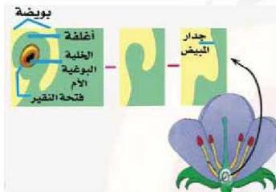

- تنقسم كل خلية بوغية ذكرية أم انقساماً منصفاً لينتج عنه أربع خلايا أحادية المجموعة الكروموسومية (n) وعند ما تنفصل عن بعضها تسمى كل منها بالبرغ الصغير (Micro-Spore (n))
- تنقسم نواة البرغ الصغير انقساماً متساوياً لينتج عنه نواتان إحداهما أنبوبية (Tube Nucleus) والأخرى تناسلية (مولدة) (Generative Nucleus).
- تمر خلية البرغ الصغير بعملية نمو وتمايز وتحاط بجدار داخلي رقيق وخارجي سميك يتخذ أشكالاً مختلفة يميز نوع النبات ويطلق عليها حبة اللقاح الناضجة.
- تنفتح أكياس الملك، وتتناثر حبوب اللقاح لتنتقل إلى البويضة فكيف يتم ذلك؟

• ما آلية انفتاح أكياس حبوب اللقاح.

موضوع المناقشة

# النشاط (٨)

- نفذ النشاط الخاص بفحص: مقطع عرضي من متك زهرة نبات، وتخصيصات جاهزة لخبوب لقاح من أزهار متنوعة متوفرة في بيتك في كتاب الأنشطة والتجارب العملية.

# ثانياً: تكوين البويضة:

انظر الشكل (١٣) ولاحظ أن البويضة تنشأ في البداية بظهور ندوة في الجدار الداخلي للمبيض يسمى النيوسيلة (Nucellus) والتي تحاط بغلاف أو غلافين تخرج منهما قناة في القمة تسمى النقير، وتتميز إحدى خلايا

الشكل (١٣) نشؤ البويضة من جدار المبيض

النيوسيلة لتكون الخلية البوغية الأنثوية الأم (Megaspore Mother Cell(2n)). لاحظ الشكل (١٤) وتتبع خطوات تكوين البويضة الناضجة من الخلية البوغية الأنثوية الأم.

الأحياء للصف الثالث الثانوي

٧٥

http://E-learning-moe.edu.ye