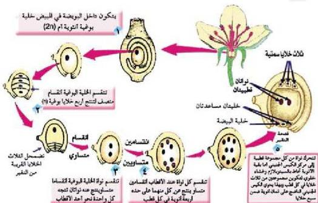

- ما عدد الخلايا الأنثوية في الكيس الجنيني الناضج؟ سمّ هذه الخلايا.
تقع خلية البيضة Egg Cell والتي تمثل المشيج المؤنث (n) مقابل فتحة التقير، ويحيط بها خليتان مساعدتان Synergids، والنواثان القطبيتان في مركز الكيس الجنيني تكوّنان خلية ثنائية النوى (2n) تسمى خلية الأندوس-بيرم الأم.

الشكل (١٤) خطوات تكوين البويضة

## النشاط (٩)

- نفذ النشاط الخاص بتركيب عضو التأنيث في نبات الفول وتركيب البويضة من خلال شريحة جاهزة لإحدى البويضات في كتاب الأنشطة والتجارب العملية.

## التلقيح والإخصاب في النباتات الزهرية :

تنقل حبوب اللقاح الناضجة من الملك إلى الميسم بواسطة الرياح أو الحشرات أو الطيور أو الماء أو الإنسان وعندما تسقط حبة اللقاح على الميسم يحدث لها ما يأتي:

1- تنتفخ بامتصاص الماء.
2- تظهر أنبوبة اللقاح من أحد المسامات وتنمو مخترقة أنسجة الميسم والقلم والمبيض بفعل إنزيمات محللة يفرزها طرف أنبوبة اللقاح.

٧٦

الأحياء: النصف الثالث الثانوي

http://E-learning-moe.edu.ye