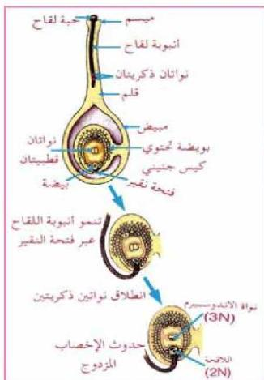

٣- تصل أنبوبة اللقاح إلى الكيس الجنيني عبر فتحة النقير.
٤- في أثناء نمو أنبوبة اللقاح تتحرك النواة الأنبوبية في أسفلها أولاً ثم تنقسم النواة المولدة لتعطي نواتين ذكريتين كلاهما أحادية المجموعة الكروموسومية، انظر الشكل (١٥).

• نفذ النشاط الخاص بدوامة أنواع وتركيب البويضة في كتاب الأنشطة.

# **النقاط (١):**

الشكل (١٥) عملية الإخصاب في النبات الزهري

كيف تتم عملية الإخصاب؟

عندما تنتقل النواتان الذكريتان إلى داخل الكيس الجنيني تتحد إحداهما مع نواة خلية البويضة فتتكون اللاقحة ثنائية المجموعة الكروموسومية وتتحد النواة الأخرى مع النواتين القطبيتين لتكون نواة الأندوسبيرم الأولية ثلاثية المجموعة الكروموسومية (3n) ويطلق على عملية الإخصاب هذه الإخصاب المضاعف

Double Fertilization

أو المزدوج وهي إحدى خواص النباتات مغطاة البذور.

# ١- البذرة والثمر:

بعد عملية الإخصاب تنقسم اللاقحة عدة مرات ليشكل الجنين وتستمر عملية النمو حتى تتكون البذرة.
- تم تركيب البذرة؟

الأحياء للصف الثالث الثانوي

٧٧

http://E-learning-moe.edu.ye