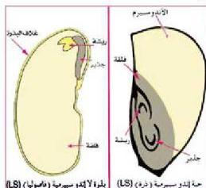

تنقسم نواة الأندوسبيرم (3n) انقساماً متساوياً لتعطي نسيج الأندوسبيرم ثلاثي المجموعة الكروموسومية المغذي للجنين. وقد يحدث أن يتغذى الجنين على الأندوسبيرم أثناء نموه وما تبقى يُخزن في الفلقتين لذلك يختفي الأندوسبيرم (يخزن في الفلقات) وتسمى البذور عندئذ لأندوسبيرمية كبذر نباتات ذوات الفلقتين مثل الفول والفاصوليا، أو يمتص الجنين بعض الأندوسبيرم والبعض الآخر يبقى محيطاً بالجنين لذا تكون هذه البذور أندوسبيرمية كبذور ذات الفلقة الواحدة مثل حبة الذرة والقمح.

– إلى ماذا تتحول البريضة الناضجة بعد الإخصاب؟

الشكل (١٦) تركيب البذرة

انظر الشكل (١٦) وتعرف على تركيب البذرة، لاحظ أن الجنين يتركب من:

١- محور قصير ينتهي طرفه من ناحية التقير بالجذير ومن الطرف المقابل بالريشة.

٢- يتصل المحور بورقة جنينية واحدة في ذوات الفلقة الواحدة أو ورقتين جنينيتين في ذوات الفلقتين وهذه الأوراق هي الفلقات.

ماذا ينتج عن نمو الجذير والريشة؟

• نفذ النشاط (١١) دراسة عملية لتركيب بعض البذور في كتاب الأنشطة والتجارب العملية.

# ٢- تكوين الثمرة:

تعد عملية الإخصاب حافزاً لتكوين هرمونات خاصة تعمل على تضخم ونمو جدار المبيض وتحويل المبيض إلى ثمرة. اذكر الهرمون الذي يقوم بذلك. وبعد نضج المبيض تذبل بقية أجزاء الزهرة وتتساقط وقد تشترك في تكوين الثمرة كالتخت (كما في التفاح).

– من تركيب الثمرة؟

عند اكتمال نضج الثمرة يتكون لها ثلاث طبقات أو أغلفة هي:

١- خارجية جلدية.

٢- وسطى متشحمة وهي التي تؤكل في أغلب الثمار (كالبلح والسدر).

٣- داخلية صلبة تحمي البذرة بداخلها ويختلف سمك وطبيعة وتركيب الطبقات الثلاث في الثمار المختلفة. (هل تعتبر حبة القمح بذرة أم ثمرة؟).

٧٨

الأحياء: النصف الثالث الثانوي

http://E-learning-moe.edu.ye