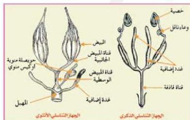

في حبة القمح والذرة وبعض الحبوب يندمج غلاف الثمرة مع غلاف البذرة لتكوين الحبة لهذا السبب تعتبر حبة القمح ثمرة وليست بذرة.

وقد وجد أن بعض النباتات تنتج ثماراً خالية من البذور تسمى بالثمار العذرية Parthenocarpic Fruit مثل بعض أصناف العنب. فما أسباب ذلك؟

يرجع تكوين الثمار العذرية إلى عدة أسباب منها:

- تكوين الثمرة دون تلقيح كما في البرتقال والموز.
- تكوين الثمرة بعد حدوث التلقيح والإخصاب دون تكون الجنين كما في العنب.
- يمكن إنتاج ثمار عذرية صناعياً يرش أزهار النباتات بهرمونات نباتية قبل حدوث الإخصاب فيها مثل نبات الشمام.

### التكاثر الجنسي في الحيوان Sexual Reproduction in Animal

تعتمد الحيوانات اللافقارية والفقارية على التكاثر الجنسي في الحفاظ على نوعها. وسوف نناقش التكاثر الجنسي في الحشرات كمثال للحيوانات اللافقارية والتكاثر الجنسي في الإنسان كمثال للحيوانات الفقارية وذلك كما يأتي:

#### التكاثر الجنسي في الحشرات:

الحشرات وحيدة الجنس أي إن هناك ذكراً ينتج أمشاجاً ذكرية، وأنثى تنتج أمشاجاً أنثوية، ويتم التكاثر عن طريق اندماج الأمشاج الذكرية والأمشاج الأنثوية. ثم يتكون الجهازان التناسليان الذكري والأنثوي في الحشرات؟

#### الجهاز التناسلي في الحشرات:

لاحظ الشكل (١٧) وتعرف على كل جزء من أجزاء الجهاز التناسلي في الحشرات.
- ما الوظائف المتناظرة التي تقوم بها الأعضاء في الجهازين التناسليين للذكر والأنثى؟

الشكل (١٧) الجهاز التناسلي في الحشرات

الأحياء للصف الثالث الثانوي

٧٩

http://E-learning-moe.edu.ye