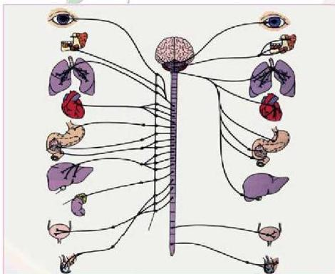

# الجهاز العصبي

Nervous System

# الوحدة الأولى

# أهداف الوحدة

يتوقع منك بعد دراستك لهذه الوحدة أن تكون قادراً على أن:

١- تتعرف على التنظيم العصبي في بعض اللافقاريات.
٢- تبين تركيب الخلية العصبية في الإنسان، ووظائف أجزائها، وآلية انتقال السيل العصبي.
٣- توضح الأجزاء الرئيسية في الجهاز العصبي للإنسان.
٤- تميز بين عمليات التنظيم الإرادية واللاإرادية للجهاز العصبي.
٥- تحدد الأنواع الرئيسية للمستقبلات الحسية، وأماكن وجودها.
٦- تصف التركيب العام للمستقبلات الحسية، ووظائفها.
٧- توضح آلية عمل المستقبلات الحسية، ووظائفها.

٨

الأحياء: النصف الثالث الثانوي

http://E-learning-moe.edu.ye