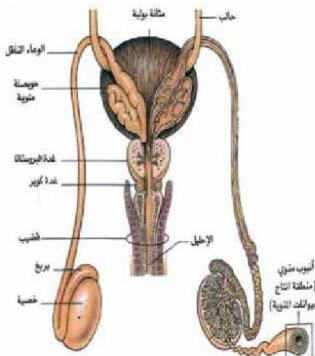
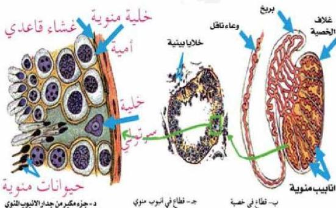

- الخلايا المنوية الأم :

Spermatogonia

تنشأ منها الحيوانات المنوية، وترتبط الأنابيب المنوية بنسيج يحتوي على أوعية دموية، وخلايا بينية تسمى خلايا ليدج Leydig Cells والتي تفرز هرمون النستوستيرون Testosterone الذي يعمل على إظهار الصفات الجنسية الثانوية في الذكر.
- ما هي هذه الصفات ؟

الشكل (١٨) الجهاز التناسلي الذكري في الإنسان

٢- الأعضاء التناسلية الثانوية (المساعدة) :

لاحظ الشكل (١٨) وادرس الجدول (٣)، لتتعرف على الأعضاء التناسلية الثانوية في ذكر الإنسان، ثم أجب على الأسئلة التي تليه :

٨١

الأحياء للصف الثالث الثانوي

http://E-learning-moe.edu.ye