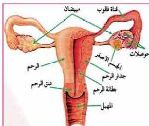

الشكل (١٩) الجهاز التناسلي الأنثوي

الأحجام بعضها تحتوي على بويضة محاطة بنسيج طلائي وتعرف بحوصلة جراف Grafian Follicle ويعد تكوين الحويصلات أهم وظائف المبيض إضافة إلى إفراز الهرمونات الجنسية الأنثوية كالإستروجينات.

٢- الأعضاء التناسلية الثانوية وتشمل:

- قناتي فالوب Fallopian Tubes.

وتبلغ طول كل قناة حوالي ١٠ سم، وجدارها مكون من ثلاث طبقات وتحتوي خلايا الطبقة الداخلية على أهداب تساعد حركتها على دفع البويضة نحو الرحم، إضافة إلى انقباض العضلات الملساء في جدار قناة فالوب.

- الرحم Uterus

عضو عضلي تتكون بطانته من نسيج طلائي وأوعية دموية، ويعتبر الرحم ممر الحيوانات المنوية عند الإخصاب، ويحدث فيه الطمث، ومكانا لزرع الجنين ونموه حتى ميلاده.

- المهبل Vagina

قناة عضلية تنقل إفرازات الرحم إلى خارج الجسم، وتسمى كذلك قناة الولادة لخروج الوليد عبرها، وتسبح فيها الحيوانات المنوية إلى داخل الرحم.

# تكوين البويضات : Oogenesis

يتم تكوين البويضات في مبيض الأنثى البالغة عبر مراحل مختلفة. لاحظ الشكل (٢٠)، لتتعرف على مراحل تكوين البويضة في الإنسان، وادرس الجدول (٦). وأجب عن الأسئلة التالية:

- ما المراحل المختلفة لتكوين البويضات في أنثى الإنسان البالغة؟ صف كل مرحلة؟
- بماذا تختلف الخليتان الناتجتان عن الانقسام المنصف الأول؟
- كم عدد الكروموسومات في البويضة الناضجة.

٨٥

الأحياء للصف الثالث الثانوي

http://E-learning-moe.edu.ye