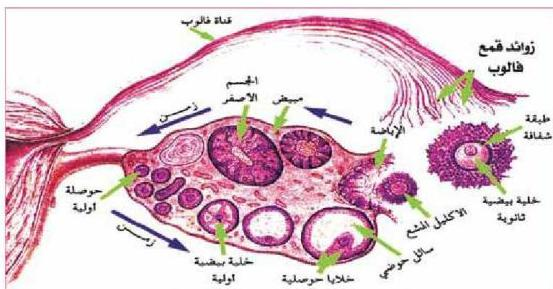

الشكل (٢٠) قطاع في المبيض يبين مراحل تكوين البويضات.

جدول (٦) مراحل تكوين البويضات

|  الوصف | المرحلة  |
| --- | --- |
|  تنقسم الخلايا التناسلية الأولية انقسامات متساوية لتنتج خلايا بيضية أم **Oogonia** | خلية تناسلية أصلية خلية بيضية أم  |
|  تتم وتطور الخلية البيضية الأم إلى خلايا بيضية أولية **Primary Oocytes** | خلية بيضية ابتدائية  |
|  تمر الخلية البيضية بالمرحلة الأولى من الانقسام المنصف لتنتج خلية كبيرة الحجم تسمى الخلية البيضية الثانوية **Secondary Oocyte** وخلية صغيرة الحجم تسمى الجسم القطبي الأول **First polar body** – تدخل الخلية البيضية الثانوية المرحلة الثانية في الانقسام المنصف عند حدوث الإخصاب باختراق الحيوان المنوي لغشاء الخلية البيضية، وتستمر المرحلة الثانوية من الانقسام لتنتج البويضات الناضجة والجسم القطبي الثاني، وقد ينقسم الجسم القطبي الأول إلى جسمين قطبيين (إضافية). | خلية بيضية ثانوية جسم قطبي أول جسم قطبي ثاني بويضات ناضجة اختصر عدد الكروموسومات في الإنسان (٤٦) إلى (٤) للتبسيط.  |

٨٦

الأحياء: النصف الثالث الثانوي

http://E-learning-moe.edu.ye