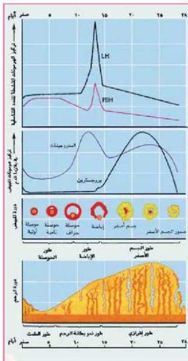

النشاط (١٢)

• نفذ النشاط الخاص بفحص شرائح مجهرية جاهزة لقطاعات عرضية في كل من خصبة ومبيض حيوان ثديي في كتاب الأنشطة والتجارب العملية.

# قضية البحث

• ابحث في موضوع بنوك الأمشاج.

# دورة الحيض Menstrual Cycle

ماذا يقصد بدورة الحيض؟
تحدث تغيرات دورية كل (٢٨ يوماً) تقريباً في مبيض وبطانة الرحم لاثني الإنسان البالغة، ومالم تتم عملية الإخصاب، وتسمى هذه التغيرات دورة الحيض.

لاحظ الشكل (٢١) وتعرف على أقسام دورة الحيض الآتية:
١- دورة المبيض وتقسم إلى:

أ - طور الحوصلة: وفيه تنضج إحدى الحوصلات مكونة بداية الدورة في أحد المبيض.

ب - طور الإباضة. ماذا يحدث لحوصلة جراف؟ ومتى؟

ج- طور الجسم الأصفر: في هذا الطور تلتهم الحوصلة الخالية من البويضة مكونة الجسم الأصفر ويستمر الجسم الأصفر حتى نهاية الدورة، في حالة حدوث الحمل وتفرز هرمونات أهمها الاستروجين والبروجسترون.

الشكل (٢١) دورة الحيض

٨٧

الأحياء للصف الثالث الثانوي

http://E-learning-moe.edu.ye