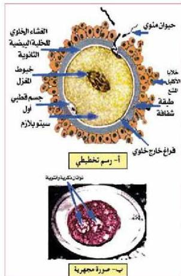

– ما الهرمونات الحافزة لأطوار دورة المبيض؟ ومن أين تفرز؟
لاحظ أن هرموني الجسم الأصفر يعملان على تثبيط الهرمونات الحافزة لأطوار المبيض لمنع نضج حوصلة جديدة.

# ٢- دورة الرحم:

ما أطوار هذه الدورة؟ ماذا يحدث فيها؟
لاحظ أنه في طور النمو والإفراز يزداد سمك بطانة الرحم وتصبح غنية بالأوعية الدموية والإفرازية لتوفير بيئة ملائمة لنمو الجنين، ويحدث ذلك بتأثير هرموني البروجسترون والإستروجين.

ماذا يحدث إذا لم تخصب البويضة؟
يضم الجسم الأصفر في اليوم (٢٤ للدورة تقريباً) وينخفض تركيز هرموناته مما يسبب انسلاخ بطانة الرحم وخروجها مع نزيف من الشعيرات الدموية يستمر من (٣-٥) أيام ويسمى ذلك طور الحيض.

الشكل (٢٢) عملية الإخصاب

# الإخصاب Fertilization

– ما المقصود بعملية الإخصاب وكيف تتم؟

لاحظ الشكل (٢٢). وكيف تتم عملية الإخصاب في الثلث الأول من قناة فالوب وفقاً للخطوات الآتية:
١- يخترق الحيوان المنوي المنطقة الشعاعية للخلية البيضية الثانوية ليصل للمنطقة الشفافة. ما الذي يساعده في تحليل هذه الطبقة؟
٢- يلتحم الغشاء البلازمي في الحيوان المنوي مع غشاء الخلية البيضية، مما يساعد على إفراز انزيمات من خلايا قشرية تقع تحت غشاء الخلية، لتكون طبقة قاسية تقلل من احتمال دخول أكثر من حيوان منوي واحد.

٨٨

الأحياء للصف الثالث الثانوي

http://E-learning-moe.edu.ye