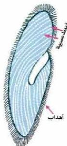

## الجهاز العصبي في الكائن الحي

– لماذا يتفاعل الكائن الحي مع المؤثرات البيئية؟

يتفاعل الكائن الحي مع المؤثرات البيئية للحفاظ على ثبات توازنه الداخلي، وتعتبر هذه الخاصية من أوضح مظاهر الحياة التي تميز الكائن الحي، سواء أكان من الكائنات البسيطة، أم الكائنات الراقية، ففي الحيوانات الراقية والإنسان نجد أن السيطرة والتنظيم للمحافظة على ثبات وضعها الداخلي يتمان بواسطة الجهازين العصبي والهرموني، والتنظيم عن طريق الأعصاب يكون عادة أسرع من التنظيم عن طريق الهرمونات.

### أولاً: الإحساس في الكائنات وحيدة الخلية:

إن الإحساس خاصية من خواص بروتوبلازم الكائن الحي، لهذا نجد مثلاً الطلائعيات الأولية مثل الأميبا تحس بالمؤثرات في الوسط الذي تعيش فيه عن طريق بروتوبلازم خليتها؛ وبهذا نجد أنها تتحرك نحو الغذاء، وتنفذ من الضوء الشديد وتبتعد عن المواد الكيميائية عالية التركيز، وفي الطلائعيات الهدبية كالبراميسوم الشكل (١)، تتصل أهدابها بحبيبات قاعدية مغمورة في بروتوبلازم البراميسوم، وتتصل هذه الحبيبات ببعضها بخيوط دقيقة، وخلال هذه الخيوط تنتقل المؤثرات الحسية إلى الحبيبات التي تتصل بدورها بالأهداب فتسبب حركتها، ويطلق على هذه الخيوط (الخيوط العصبية) يتضح من ذلك عدم وجود جهاز عصبي متخصص في الكائنات وحيدة الخلية.

### ثانياً: الجهاز العصبي في الحيوان:

تختلف الحيوانات في مستوى التنظيم العصبي بحسب موقعها في ممالك الكائنات الحية، ومن الملاحظ أن صورة بناء التنظيم العصبي في الحيوانات المختلفة يكون أكثر رقياً وقدرة على إتقان العمل كلما اتجهنا نحو الأنواع الراقية من الحيوانات. ويتمثل هذا الاتجاه بتجميع الخلايا العصبية في جهاز عصبي مركزي، وذلك لزيادة القدرة على السيطرة، والتنظيم، والتنسيق، ورقي مستوى الاستجابة للمؤثرات البيئية، مما يساعد الكائن الحي في الحفاظ على اتزان بيئته الداخلية.

الشكل (١) الخيوط العصبية في البراميسوم.

٩

الأحياء للصف الثالث الثانوي

http://E-learning-moe.edu.ye