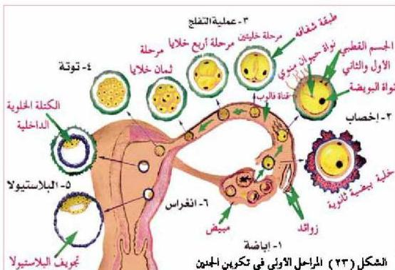
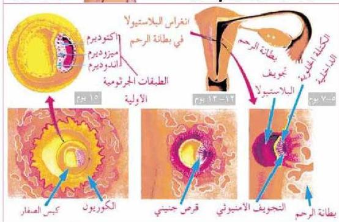

الشكل (٢٤) انغراس الجنين في بطانة الرحم وتكون الطبقات الجرثومية الثلاث

ما الأعضاء والأجهزة التي تنشأ من الطبقات الجرثومية الثلاث؟
تعرف على ذلك من دراسة الجدول الآتي:

٩٠

الأحياء للصف الثالث الثانوي

http://E-learning-moe.edu.ye