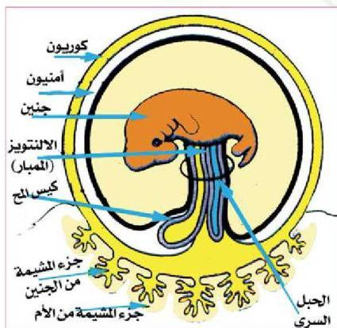

# جدول (١٠) أجزاء المشيمة ووصفها

|  أجزاء المشيمة | الوصف  |
| --- | --- |
|  الرحمي (الامي) | ينتشر به جيوب كثيرة تمتلئ دماً من أفرع شريانية من الأم، ويعود الدم فيها إلى الأم بأفرع وريدية.  |
|  الجنيني | يتكون من خملات من الكوريون تمتد في كل حملة شعيرات دموية دقيقة ناتجة عن تفرعات الأوعية الدموية للحبل السري.  |

عرفت سابقاً
أن دم الأم لا
يختلط بدم
الجنين، فكيف
يتم مرور المواد
بينهما؟
يحدث
تبادل بين دم الأم
ودم الجنين عن
طريق الانتشار
عبر المشيمة.
يأخذ الجنين المواد
الغذائية
والأكسجين

الشكل (٢٥) الأغشية الجنينية
من دم الأم، ويتخلص من ثاني أكسيد الكربون والمواد الإخراجية النيتروجينية.

■ ابحث في موضوع مراحل المخاض (الولادة).

قضية البحث

٩٢

الأحياء للصف الثالث الثانوي

http://E-learning-moe.edu.ye