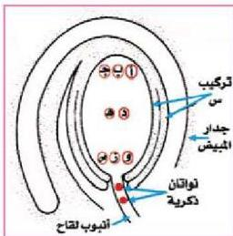

## تقويم الوحدة

١- ماذا يقصد بالآتي:

- التكاثر البكري.
- التبوغ
- ظاهرة تبادل الأجيال.
- دورة الحيض.
- التكاثر الخضري.
- الأغشية الجنينية.

٢- علل ما يأتي:

- ظهور أعراض الملاريا بشكل دوري.
- عدم تكوين بويضات جديدة خلال فترة الحمل في المرأة.
- تلازم تركيب الحيوان المنوي مع وظيفته.
- إفرازات الغدد المساعدة في الجهاز التناسلي الذكري قلوية التأثير.

٣- الشكل المجاور يبين مقطعاً خلال المبيض وأنبوبة اللقاح نبات قبل عملية الإخصاب.

أ - أي الخلايا المبينة بالحروف تندمج مع الأنوية الذكرية تتكون الآتي:
- الأندوسبيرم.
- الزيجوت.

ب - بعد عملية الإخصاب ما هو التركيب الذي سوف يظهر من تطور كل من الآتي:

- جدار المبيض. التركيب س.
- ج - حدد العدد الكروموسومي الذي يوجد في:
- نواة خلايا التركيب س.
- نواة الخلية ج.
- أنوية الأندوسبيرم.

الأحياء للصف الثالث الثانوي

http://E-learning-moe.edu.ye

٩٣