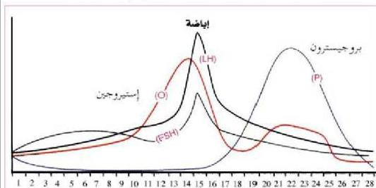

٤- وضع بإيجاز الطرق التي يمكن استخدامها للحصول على:
- أفضل عقلة من نبات الورد وتكثيرها.
- ثمار عذرية.

٥- ما وظيفة الآتي:

- مبيض اثني الإنسان. - البربخ. - المحصيتان في الإنسان.

٦- قارن بين اثنين في كل فقرة مما يأتي:

أ - الدورة الجنسية واللاجنسية في طفيل بلازموديوم الملاريا من حيث عددها، ومكان حدوثها.

ب - الطور المشيجي، والبوغي في الفيوناريا من حيث المجموعة الكروموسومية.
ج - التطعيم بالبرعم، والتطعيم بالقلم من حيث آلية التحضير للطعم والأصل، وآلية وضع الطعم في الأصل.

٧- ادرس الشكل اللاحق الذي يوضح العلاقة في تركيز الهرمونات لدورة الحيض والمطلوب تحديد أثر الآتي:

أ - الزيادة المفاجئة في تركيز LH.

ب - إقرار الجسم الأصفر هرمون البروجيسترون بعد اليوم الرابع عشر من الدورة.
ج - هرمونات:

- FSH على حوصلة جراف.

- البروجيسترون والإستيروجيين على الرحم في دورة الحيض.

٩٤

الأحياء للصف الثالث الثانوي

http://E-learning-moe.edu.ye