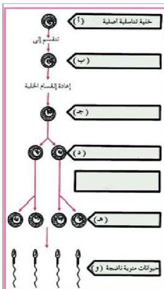

٨- الشكل المبين أدناه يبين مراحل تكوين الحيوانات المنوية في الثدييات.

أ - سمّ أنواع الخلايا في الفراغات المناسبة في ب، ج، د، هـ، ونوع الانقسام الذي حدث بين المرحلتين د، هـ.

ب - بماذا يختلف تكوين الحيوانات المنوية عن تكوين البويضات.

الأحياء للصف الثالث الثانوي

http://E-learning-moe.edu.ye

٩٥