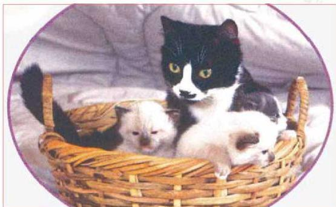

# أساسيات علم الوراثة
Principles Of Genetics

# الوحدة الرابعة

جيل الأبناء يحمل صفات الآباء

# أهداف الوحدة

يتوقع منك بعد دراستك لهذه الوحدة أن تكون قادراً على أن:

١- توضح تجارب مندل وقوانينه في الوراثة.
٢- تشرح كلاً من مفهوم السيادة التامة والسيادة الناقصة، والسيادة المشتركة والارتباط والعبور.
٣- تستخدم قوانين الوراثة في حل المسائل الوراثية المختلفة.
٤- تتعرف على بعض الأمراض الوراثية المتقلبة من الآباء إلى الأبناء.
٥- توضح دور الكروموسومات الجنسية في وراثة بعض الصفات.

٩٦

الأحياء للصف الثالث الثانوي

http://E-learning-moe.edu.ye

٩٦