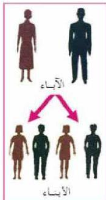

## أساسيات علم الوراثة Principles of Genetics

لاحظ الإنسان منذ القدم أن الأبناء تأتي شبيهة بآبائها، فالقطط تشبه آباءها، والآباء في البشر يخلّفون بشراً مثلهم، انظر (الشكل - ١)، والنبات الناتج عن نوع من البذور يأتي مشابهاً للنباتات التي أنتجت تلك البذور، وهكذا في بقية الكائنات الحية. ولقد توصل الإنسان إلى أن تشابه الأجيال المتعاقبة في الكائن الحي يحدث نتيجة لتوارث الأبناء صفات وخصائص الآباء جيلاً بعد جيل. ويطلق على هذه الظاهرة توارث الصفات أو الوراثة.

- فما المقصود بالوراثة؟

يقصد بالوراثة انتقال صفات وخصائص الآباء إلى الأبناء في الأجيال المتعاقبة.

الشكل (١) الأبناء تشبه الآباء لكن قد يأتي الأبناء مختلفين عن الآباء في بعض الصفات الظاهرة كاللون مثلاً، ولم يدرك أسباب التشابه والتباين بين أفراد النوع الواحد من الكائنات الحية إلا في العصر الحديث عندما عرفت آليات انتقال الصفات الوراثية من الآباء إلى الأبناء بواسطة علم جديد أطلق عليه علم الوراثة (Genetics).

وهو: العلم الذي يبحث في كيفية انتقال الصفات من الآباء إلى الأبناء في الكائنات الحية المختلفة وأسباب تشابه الصفات وتباينها بين أفراد النوع الواحد.

- كيف تطور علم الوراثة؟
- كيف يتوارث الأبناء صفات وخصائص الآباء؟
- كيف يظهر التشابه والتباين في الصفات بين أفراد النوع الواحد؟

الأحياء للصف الثالث الثانوي

٩٧

http://E-learning-moe.edu.ye