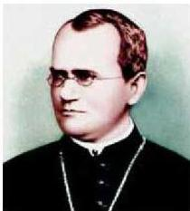

- ما وسيلة نقل الصفات الوراثية من الآباء إلى الأبناء؟
يتم نقل الصفات الوراثية من الآباء إلى الأبناء بواسطة عملية التكاثر؛ وذلك عبر الأمشاج التناسلية التي تنتقل عبرها صفات الآباء وخصائصها إلى أبنائهم مما يجعل سلالات النوع الواحد متشابهة منذ ظهورها على سطح الأرض.

## تطور علم الوراثة الحديث:

تأسس علم الوراثة الحديث على يد العالم جريجور مندل Gregor Mendel الذي عاش في القرن التاسع عشر (١٨٢٢ - ١٨٨٤م). وقد قام بإجراء تجاربه حول توارث الصفات على نبات البازلاء (Pisum Sativum) في حديقة الدير الذي كان يعمل فيه، مستخدماً الأسلوب العلمي في البحث والتجريب، مما ساعده في وضع الأسس الحالية لعلم الوراثة والتوصل إلى بعض قوانينها.

- ولد جريجور مندل في عام ١٨٢٢م في النمسا.
- أصبح راهباً ومدرساً للعلوم والرياضيات في جامعة فيينا عام ١٨٤٣م.
- انقطع للرهينة وتدريس العلوم في الدير الذي يعمل فيه حتى عام ١٨٦٨م.
- بدأ تجاربه على نبات البازلاء في حديقة الدير الذي يعمل فيه عام ١٨٥٦م.
- أعلن تجاربه ونشرها عام ١٨٦٦م، ولم تكن هناك أية معلومات متوفرة

- عن الكروموسومات والجينات.
- لم يهتم العلماء بنتائج أبحاثه حول الوراثة وظلت تجاربه ونتائجها مجهولة حتى عام ١٩٠٠م.
- توفي العالم مندل عام ١٨٨٤م.
- أطلق عليه أبو علم الوراثة الحديثة، بعد كشف النقاب بواسطة بعض العلماء عن أهمية ما توصل إليه في بداية القرن العشرين.

٩٨

الأحياء للصف الثالث الثانوي

http://E-learning-moe.edu.ye