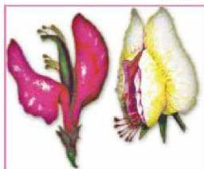

– لماذا اختار مندل نبات البازلاء لتجاربه؟

اختار مندل نبات البازلاء لتجاربه لأن هذا النبات :

١- موسمي ويمكن زراعته ٣-٤ مرات في العام الواحد.
٢- له عدة أصناف تحمل صفات متضادة متعددة وواضحة.
٣- يمكن زراعته ومتابعة نموه بسهولة.
٤- يمكن الحصول على سلالات نقية منه.
٥- يحمل أزهاراً خنثى مما يجعل من الممكن إخصابه ذاتياً أو خلطياً.
– ما المقصود بالأزهار الخنثى؟ لاحظ الشكل (١).

– كيف يتم التلقيح فيها؟

٦- ومن حسن حظ مندل أن كل عامل من عوامل الصفة يحمل على كروموسوم مستقل.

وقد لاحظ مندل أن هناك سبعة أزواج من الصفات المتضادة أو المتقابلة كما في الشكل (٣) مثل طول الساق

الشكل (٢) لون الأزهار في نبات البازلاء

(بعضها طويل الساق والبعض الآخر قصير)، ولون الزهرة (بعضها يحمل أزهاراً وردية اللون والبعض الآخر يحمل أزهاراً بيضاء). لاحظ الصفات المتضادة في نبات البازلاء في شكل (٣).

## النشاط (١)

• التعرف على الصفات المتضادة لنبات أو حيوان.

الأحياء للصف الثالث الثانوي

http://E-learning-moe.edu.ye

٩٩