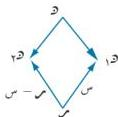
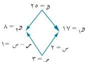

الوحدة الثالثة

## ثانياً: السحب بدون إعادة :

**السحب بدون إعادة هو** السحب مرة أخرى بدون إعادة الشيء المسحوب وبذلك تصبح كل سحبة متأثرة بالتي قبلها ؛ وعندئذٍ تصبح الحوادث غير مستقلة عن بعضها . في هذه الحالة لا يمكن أن نستخدم ما قد درسناه في متتالية التكرارات المستقلة وقانون الاحتمال الثنائي ، وإنما نبحث عن قانون آخر نستخدمه في حالة السحب بدون إعادة وقبل أن نستنتج هذا القانون نقدم الآتي :

نفرض أن لدينا صندوقاً يحتوي على « و » شيئاً منها و١ من النوع الأول، و٢ = و - و١ من النوع الثاني، وإذا سحبنا - عشوائياً - وبدون إعادة « م » شيئاً . فما هو احتمال الحصول على « س » شيئاً من النوع « الأول » ؟
ولحساب هذا الاحتمال نوجد :

١) عدد الحالات الممكنة = ٥ و ٧

٢) عدد الحالات الملائمة = ١٥ و ٢٠ و ٢٥ و ٣٠ = ( ١٥ ) و ( ٢٠ ) و ( ٣٠ ) و ( ٤٠ ) و ( ٥٠ ) و ( ٦٠ ) و ( ٨٠ )

وعليه يكون احتمال الحصول على « س » شيئاً من النوع و١ هو :

شكل (٣ - ٤)

$$\text{حا ( س )} = \frac{١٥ و ٢٠ و ٢٥ و ٣٠}{٥ و ٧}$$

وهو قانون السحب بدون إعادة، ويمكن كتابة هذا القانون هندسياً بطريقة المعين كما في [ الشكل (٣ - ٤ ) ] .

### مثال (٣ - ١٩)

صندوق يحتوي على ٢٥ كرة ، منها ١٧ حمراوات ، ٨ بيضاوات . سحبت من الصندوق - عشوائياً - ٣ كرات معاً بدون إعادة . فما احتمال أن تكون كرتان منها حمراوين ؟

### الحل :

من الشكل (٣ - ٥) :

نفرض أن : ١ هي حادثة سحب كرتين حمراوين :

شكل (٣ - ٥)

$$\therefore \text{حا ( س = ٢ )} = \text{حا ( ١ )} = \frac{١٧ و ٢٠ و ٢٥ و ٣٠}{٢٥ و ٣٠} = \frac{١٠٨٨}{٢٣٠٠} = ٠,٤٧٣٠$$

١٠٠

http://www.e-learning-moe.edu.ye/