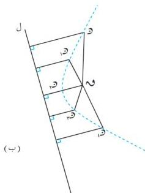
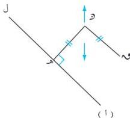

القطع الخروطة

وعليه فإن المجموعة { (س ، ص ) : س² + ص² - ١٢ س - ٢ ب ص + ج = ٠ ، س ، ص ≤ ج } .
يمكن أن تكون خالية أو نقطة أو دائرة اعتماداً على المقدار ٢ + ب² - ج سالباً أو مساوياً للصفر أو موجباً .
وفي الحالة الأخيرة تكون النقطة م ( ١ ، ب ) مركز الدائرة ، وطول نصف قطرها نفع = ٢ + ب² - ج .
وانطلاقاً من هذا سنوجد معادلة القطع الخروطة المتبقية على أساس أنها عبارة عن معادلات من الدرجة الثانية
وستتعرف على شكل منحنياتها .

فمثلاً المعادلات :

ص² + ١ س = ٠ ، ٢ س² + ص² = ب² ، ٤ ص² - س² = ٢ .
عبارة عن معادلات من الدرجة الثانية ولكنها لا تمثل دائرة لأن معاملي س² ، ص² غير متساويين .

## القطع المكافئ

٤ - ٢

في الشكل ( ٤ - ٢ ) إذا فرضنا ن نقطة ثابتة ، ل مستقيماً ثابتاً ، وتحركت النقطة و في
مستواهما بحيث يكون بعدها عن ن مساوياً بعدها عن ل ، فإن و ترسم منحنياً كما في
الشكل ( ٤ - ٢ ب ) يسمى قطعاً مكافئاً .

شكل ( ٤ - ٢ )

### تعريف ( ٤ - ١ )

القطع المكافئ هو مجموعة كل النقاط في المستوى التي يُبعدها عن نقطة ثابتة يساوي بُعدها عن
مستقيم ثابت . تُسمى النقطة الثابتة بؤرة القطع المكافئ ويسمى المستقيم الثابت دليل القطع المكافئ .

١٠٥

http://www.e-learning-moe.edu.ye/