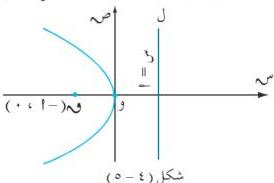
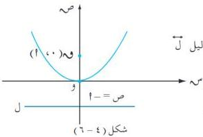
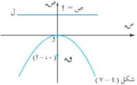

القطع الخروطية

فالمعادلة (٤ - ١) هي معادلة قطع مكافئ تقع بؤرته في النقطة (١ ، ٠) ، ومعادلة دليله هي س = ١ ، ومحوره هو محور السينات ورأس القطع هي نقطة الأصل .

وإذا بادنا موضعي البؤرة والدليل فإن معادلة القطع تتغير تبعاً لذلك ويمكن أن تأخذ الصور التالية التي يمكن استنتاجها بسهولة من التعريف :

(١) عندما تكون بؤرة القطع هي م (٠ ، ١) ، الدليل ل معادلته س = ١ كما في [شكل (٤ - ٥) ] ورأس القطع هي نقطة الأصل ، فإن معادلة القطع هي :

ص = ٢ = ٤ س ، ١ < ٠ ... (٤ - ٢)

(٢) عندما تكون البؤرة هي م (٠ ، ١) ومعادلة الدليل ل هي ص = ١ ورأسه نقطة الأصل ، فإن معادلة القطع هي :

س = ٢ = ٤ ص ، ١ < ٠ ... (٤ - ٣)

ومحور الصادات هو محور ثمانته [ شكل (٤ - ٦) ] .

(٣) كذلك إذا كانت البؤرة م (٠ ، ١) ومعادلة الدليل ل هي ص = ١ ورأسه نقطة الأصل [شكل (٤ - ٧) ] فإن معادلة القطع هي :

س = ٢ = ٤ ص ، ١ < ٠ ... (٤ - ٤)

**ملاحظة :** تُسمى المعادلات من (٤ - ١) إلى (٤ - ٤) بالمعادلات القياسية للقطع المكافئ .

وبمقارنة الصور المختلفة لمعادلة القطع المكافئ والأشكال البيانية المرافقة لها نلاحظ أنه إذا أخذت معادلة القطع الصورة : ص = ٢ = ٤ س ، تكون فتحة القطع وفق الاتجاه الموجب (اليمين) أو الاتجاه السالب (اليسار) محور السينات تبعاً لإشارة المقدار ٤ س موجبة أو سالبة [انظر الشكلين (٤ - ٣) و (٤ - ٥) ] .

وإذا أخذت معادلة القطع المكافئ الصورة س = ٢ = ٤ ص تكون فتحته وفق الاتجاه الموجب (أعلى) أو الاتجاه السالب (أسفل) محور الصادات تبعاً لإشارة المقدار ٤ ص موجبة أو سالبة [انظر الشكلين (٤ - ٦) و (٤ - ٧) ] .

١٠٧

http://www.e-learning-moe.edu.ye/