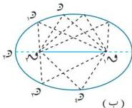
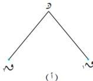

الوحدة الرابعة

## تمارين ومسائل (٤-١)

[١] أوجد معادلة القطع المكافئ الذي يحقق الشروط الآتية :

أ) الرأس (٠,٠٠) ، البؤرة (٠,٦٠) ب) الرأس (٠,٠٠) ، والبؤرة (٠,٣٠-).

ج) الرأس (٠,٠٠) ، ومعادلة الدليل ص = ٢ د) البؤرة (٠,٠٠ - ٥/٢) ، ومعادلة الدليل ص = ٥/٢

[٢] أوجد إحداثي البؤرة ومعادلة الدليل ، ثم ارسم القطع المكافئ في الحالات التالية :

أ) ص² = ٨ س ب) ص² = ٦ س

ج) س = ص² د) ص² = ١٠ س

هـ) ص² = ٨ س و) ص² = ٤/٩ س

[٣] أوجد معادلة القطع المكافئ الذي رأسه نقطة الأصل ومحوره هو المحور السيني ويمر بالنقطة (٦-٨).

[٤] أثبت أن النقطة (٣, ٣) تقع داخل القطع المكافئ ص² = ٦ س.

[٥] أوجد معادلات القطع المكافئة في الحالات التالية :

أ) الدليل س = ٨ ، البؤرة (٢, ٢)

ب) الدليل ص = ٧- ، البؤرة (٢, ١)

## القطع الناقص ٤-٣

تأمل الشكل (٤-١١): لتكن ١، ٢، ٣ نقطتين ثابتتين ، والنقطة و تتحرك في مستوى هاتين النقطتين بحيث يكون ١ و ٢ و ٣ | ١ و ٢ و ٣ | طولاً ثابتاً ، نلاحظ أن و ترسم منحنيّاً يسمى قطعاً ناقصاً [شكل (٤-١١ ب)].

شكل (٤-١١)

١١٠

http://www.e-learning-moe.edu.ye/