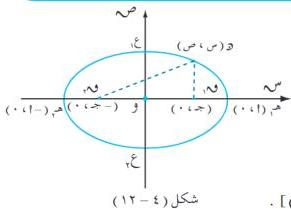

القطع الخروطة

# تعريف (٤ - ٣)

القطع الناقص هو مجموعة كل النقاط في المستوى التي مجموع بُعديها عن نقطتين ثابتتين في المستوى يساوي طولاً ثابتاً . تُسمّى النقطتان الثابتتان بؤرتي القطع الناقص .

# معادلة القطع الناقص :

ليكن س و ص مستوى الإحداثيات المتعامدة ، لتكن ١ ، ٢ ، ٣ ، ٤ ، ٥ ، ٦ ، ٧ ، ٨ ، ٩ ، ١٠ ، ١١ ، ١٢ ، ١٣ ، ١٤ ، ١٥ ، ١٦ ، ١٧ ، ١٨ ، ١٩ ، ٢٠ ، ٢١ ، ٢٢ ، ٢٣ ، ٢٤ ، ٢٥ ، ٢٦ ، ٢٧ ، ٢٨ ، ٢٩ ، ٣٠ ، ٣١ ، ٣٢ ، ٣٣ ، ٣٤ ، ٣٥ ، ٣٦ ، ٣٧ ، ٣٨ ، ٣٩ ، ٤٠ ، ٤١ ، ٤٢ ، ٤٣ ، ٤٤ ، ٤٥ ، ٤٦ ، ٤٧ ، ٤٨ ، ٤٩ ، ٥٠ ، ٥١ ، ٥٢ ، ٥٣ ، ٥٤ ، ٥٥ ، ٥٦ ، ٥٧ ، ٥٨ ، ٥٩ ، ٦٠ ، ٦١ ، ٦٢ ، ٦٣ ، ٦٤ ، ٦٥ ، ٦٦ ، ٦٧ ، ٦٨ ، ٦٩ ، ٧٠ ، ٧١ ، ٧٢ ، ٧٣ ، ٧٤ ، ٧٥ ، ٧٦ ، ٧٧ ، ٧٨ ، ٧٩ ، ٨٠ ، ٨١ ، ٨٢ ، ٨٣ ، ٨٤ ، ٨٥ ، ٨٦ ، ٨٧ ، ٨٨ ، ٨٩ ، ٩٠ ، ٩١ ، ٩٢ ، ٩٣ ، ٩٤ ، ٩٥ ، ٩٦ ، ٩٧ ، ٩٨ ، ٩٩ ، ١٠٠

١ ، ٢ ، ٣ ، ٤ ، ٥ ، ٦ ، ٧ ، ٨ ، ٩ ، ١٠ ، ١١ ، ١٢ ، ١٣ ، ١٤ ، ١٥ ، ١٦ ، ١٧ ، ١٨ ، ١٩ ، ٢٠ ، ٢١ ، ٢٢ ، ٢٣ ، ٢٤ ، ٢٥ ، ٢٦ ، ٢٧ ، ٢٨ ، ٢٩ ، ٣٠ ، ٣١ ، ٣٢ ، ٣٣ ، ٣٤ ، ٣٥ ، ٣٦ ، ٣٧ ، ٣٨ ، ٣٩ ، ٤٠ ، ٤١ ، ٤٢ ، ٤٣ ، ٤٤ ، ٤٥ ، ٤٦ ، ٤٧ ، ٤٨ ، ٤٩ ، ٥٠ ، ٥١ ، ٥٢ ، ٥٣ ، ٥٤ ، ٥٥ ، ٥٦ ، ٥٧ ، ٥٨ ، ٥٩ ، ٦٠ ، ٦١ ، ٦٢ ، ٦٣ ، ٦٤ ، ٦٥ ، ٦٦ ، ٦٧ ، ٦٨ ، ٦٩ ، ٧٠ ، ٧١ ، ٧٢ ، ٧٣ ، ٧٤ ، ٧٥ ، ٧٦ ، ٧٧ ، ٧٨ ، ٧٩ ، ٨٠ ، ٨١ ، ٨٢ ، ٨٣ ، ٨٤ ، ٨٥ ، ٨٦ ، ٨٧ ، ٨٨ ، ٨٩ ، ٩٠ ، ٩١ ، ٩٢ ، ٩٣ ، ٩٤ ، ٩٥ ، ٩٦ ، ٩٧ ، ٩٨ ، ٩٩ ، ١٠٠

لتكن ١ ، ٢ ، ٣ ، ٤ ، ٥ ، ٦ ، ٧ ، ٨ ، ٩ ، ١٠ ، ١١ ، ١٢ ، ١٣ ، ١٤ ، ١٥ ، ١٦ ، ١٧ ، ١٨ ، ١٩ ، ٢٠ ، ٢١ ، ٢٢ ، ٢٣ ، ٢٤ ، ٢٥ ، ٢٦ ، ٢٧ ، ٢٨ ، ٢٩ ، ٣٠ ، ٣١ ، ٣٢ ، ٣٣ ، ٣٤ ، ٣٥ ، ٣٦ ، ٣٧ ، ٣٨ ، ٣٩ ، ٤٠ ، ٤١ ، ٤٢ ، ٤٣ ، ٤٤ ، ٤٥ ، ٤٦ ، ٤٧ ، ٤٨ ، ٤٩ ، ٥٠ ، ٥١ ، ٥٢ ، ٥٣ ، ٥٤ ، ٥٥ ، ٥٦ ، ٥٧ ، ٥٨ ، ٥٩ ، ٦٠ ، ٦١ ، ٦٢ ، ٦٣ ، ٦٤ ، ٦٥ ، ٦٦ ، ٦٧ ، ٦٨ ، ٦٩ ، ٧٠ ، ٧١ ، ٧٢ ، ٧٣ ، ٧٤ ، ٧٥ ، ٧٦ ، ٧٧ ، ٧٨ ، ٧٩ ، ٨٠ ، ٨١ ، ٨٢ ، ٨٣ ، ٨٤ ، ٨٥ ، ٨٦ ، ٨٧ ، ٨٨ ، ٨٩ ، ٩٠ ، ٩١ ، ٩٢ ، ٩٣ ، ٩٤ ، ٩٥ ، ٩٦ ، ٩٧ ، ٩٨ ، ٩٩ ، ١٠٠

$$\sqrt{1 + 2(1 - 2)} = \sqrt{1 + 2(1 - 2)} = \sqrt{1 + 2(1 - 2)} = \sqrt{1 + 2(1 - 2)} = \sqrt{1 + 2(1 - 2)} = \sqrt{1 + 2(1 - 2)} = \sqrt{1 + 2(1 - 2)} = 1$$

$$\therefore \sqrt{1 + 2(1 - 2)} = \sqrt{1 + 2(1 - 2)} = \sqrt{1 + 2(1 - 2)} = \sqrt{1 + 2(1 - 2)} = \sqrt{1 + 2(1 - 2)} = 1$$

$$\therefore \sqrt{1 + 2(1 - 2)} = \sqrt{1 + 2(1 - 2)} = \sqrt{1 + 2(1 - 2)} = \sqrt{1 + 2(1 - 2)} = \sqrt{1 + 2(1 - 2)} = 1$$

ويتربع الطرفين نحصل على :

$$(1 - 2) + (2 - 3) + (3 - 4) + (4 - 5) + (5 - 6) + (6 - 7) + (7 - 8) + (8 - 9) + (9 - 10)$$

$$\Leftrightarrow \sqrt{1 + 2(1 - 2)} = \sqrt{1 + 2(1 - 2)} = \sqrt{1 + 2(1 - 2)} = \sqrt{1 + 2(1 - 2)} = \sqrt{1 + 2(1 - 2)} = 1$$

ويتربع الطرفين مرة أخرى نجد أن :

$$(1 + 2) + (2 - 3) + (3 - 4) + (4 - 5) + (5 - 6) + (6 - 7) + (7 - 8) + (8 - 9) + (9 - 10)$$

$$\Leftrightarrow (1 + 2) + (2 - 3) + (3 - 4) + (4 - 5) + (5 - 6) + (6 - 7) + (7 - 8) + (8 - 9) + (9 - 10)$$

وللتبسيط نضع ١ ، ٢ ، ٣ ، ٤ ، ٥ ، ٦ ، ٧ ، ٨ ، ٩ ، ١٠ ، ١١ ، ١٢ ، ١٣ ، ١٤ ، ١٥ ، ١٦ ، ١٧ ، ١٨ ، ١٩ ، ٢٠ ، ٢١ ، ٢٢ ، ٢٣ ، ٢٤ ، ٢٥ ، ٢٦ ، ٢٧ ، ٢٨ ، ٢٩ ، ٣٠ ، ٣١ ، ٣٢ ، ٣٣ ، ٣٤ ، ٣٥ ، ٣٦ ، ٣٧ ، ٣٨ ، ٣٩ ، ٤٠ ، ٤١ ، ٤٢ ، ٤٣ ، ٤٤ ، ٤٥ ، ٤٦ ، ٤٧ ، ٤٨ ، ٤٩ ، ٥٠ ، ٥١ ، ٥٢ ، ٥٣ ، ٥٤ ، ٥٥ ، ٥٦ ، ٥٧ ، ٥٨ ، ٥٩ ، ٦٠ ، ٦١ ، ٦٢ ، ٦٣ ، ٦٤ ، ٦٥ ، ٦٦ ، ٦٧ ، ٦٨ ، ٦٩ ، ٧٠ ، ٧١ ، ٧٢ ، ٧٣ ، ٧٤ ، ٧٥ ، ٧٦ ، ٧٧ ، ٧٨ ، ٧٩ ، ٨٠ ، ٨١ ، ٨٢ ، ٨٣ ، ٨٤ ، ٨٥ ، ٨٦ ، ٨٧ ، ٨٨ ، ٨٩ ، ٩٠ ، ٩١ ، ٩٢ ، ٩٣ ، ٩٤ ، ٩٥ ، ٩٦ ، ٩٧ ، ٩٨ ، ٩٩ ، ١٠٠$$

$$(4 - 5) \dots \dots \dots$$

$$1 = \frac{2}{3} \frac{1}{2} + \frac{2}{3} \frac{1}{2}$$

يطلق على المعادلة (٤ - ٥) الصورة القياسية لمعادلة القطع الناقص .

١١١

http://www.e-learning-moe.edu.ye/