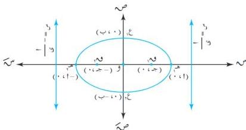

الوحدة الرابعة

[ أنظر شكل ( ٤ - ١٣ ) ]

شكل ( ٤ - ١٣ )

# تعريف ( ٤ - ٤ )

١ - تُسمَّى القطعة المستقيمة هـ، هـ، هـ، هـ، هـ، هـ، هـ، هـ، هـ، هـ، هـ، هـ، هـ، هـ، هـ، هـ، هـ، هـ، هـ، هـ، هـ، هـ، هـ، هـ، هـ، هـ، هـ، هـ، هـ، هـ، هـ، هـ، هـ، هـ، هـ، هـ، هـ، هـ، هـ، هـ، هـ، هـ، هـ، هـ، هـ، هـ، هـ، هـ، هـ، هـ، هـ

# ملاحظات :

في معادلة القطع الناقص $$\frac{2m}{2} + \frac{2m}{2} = 1$$ ، [ أنظر شكل ( ٤ - ١٣ ) ] تلاحظ أن :

١ - إذا استبدلنا ( س ) بـ ( - س ) فمعادلة القطع لا تتغير ، أي أن القطع الناقص متماثل حول محور السينات . كذلك القطع الناقص متماثل حول محور الصادات .
٢ - طول المحور الأكبر يساوي ١٢ وطول المحور الأصغر يساوي ٢ ب .
٣ - التخاليف المركزي $$\text{ي} = \frac{\text{ج}}{\text{أ}} = \sqrt{1 - \frac{\text{ب}}{\text{أ}}} \text{ حيث } \text{ي} > 1$$
٤ - بؤرتا القطع الناقص هما ( ± ١ ) ، ( ± ٠ ) ، ( ± ٠ ) .
٥ - معادلنا دليلي القطع الناقص $$\text{س} = \pm \frac{\text{أ}}{\text{ج}} = \pm \frac{\text{أ}}{\text{ب}}$$ .

١١٢

http://www.e-learning-moe.edu.ye/