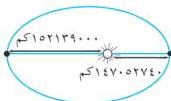

القطع الخروطية

شكل (٤ - ١٦)

∴ ١٤٩٥٩٥٨٧٠ = ١

∴ بُعد الشمس عن المركز = ج

∴ ج = ١٤٩٥٩٥٨٧٠ - ١٤٧٠٥٢٧٤٠ = ٢٥٤٣١٣٠ كم

∴ التخالف المركزي « ي » = $$\frac{ج}{١} = \frac{٢٥٤٣١٣٠}{١٤٩٥٩٥٨٧٠} = ٠.٠١٧$$

[ انظر الشكل (٤ - ١٦ ) ]

## تمارين ومسائل (٤ - ٢)

[١] أوجد طولي المحورين ، التخالف المركزي ، إحداثي البؤرتين والرأسين ومعادلتين الدليلين لكل مما يلي :

أ) ٩ س² + ٢٥ ص² = ٢٢٥ ب) ٩ س² + ١٦ ص² = ١٤٤

ج) ٢٥ س² + ١٦ ص² = ٤٠٠ د) ٤ س² + ٩ ص² = ١

[٢] في كل مما يأتي أوجد معادلة القطع الناقص الذي يحقق الشروط المعطاة ، ثم أوجد معادلتين دليلية :

أ) الرأس ( ٠ ، ٥ ± ) ، والبؤرتان ( ٠ ، ٤ ± ) ب) الرأس ( ٠ ، ٥ ± ) ، والبؤرتان ( ٠ ، ٣ ± )

ج) البؤرتان ( ٠ ، ٢ ± ) ، والتخالف المركزي $$\frac{1}{2}$$

د) البؤرتان ( ٠ ، ٤ ± ) ، والتخالف المركزي $$\frac{4}{5}$$

هـ) طول المحور الأكبر ١٠ وينطبق على محور السينات ، طول المحور الأصغر ٨ ، ومركزه نقطة الأصل .

و) محورا القطع هما محورا الإحداثيات ، والقطع يمر بالنقطتين ( ٤ ، ٣ ) ، ( ١ - ٤ )

ز) البؤرتان هما ( ٠ ، ٣ ± ) ، والقطع يمر بالنقطة ( ١ ، ٤ )

ح) التخالف المركزي $$\frac{3}{4}$$ والبؤرتان على محور السينات ، والمركز في نقطة الأصل ، والقطع يمر بالنقطة ( ٦ ، ٤ )

[٣] أوجد معادلة المنحنى الذي ترسمه النقطة و التي تتحرك بحيث يكون مجموع بُعديها عن النقطتين

( ٠ ، ٣ ) ، ( ٠ ، ٩ ) يساوي ١٢ .

[٤] أوجد معادلة القطع الناقص الذي بؤرته النقطتان ( ٠ ، ٤ ± ) ودليلاه س = ٦ ± .

[٥] يدور كوكب بلوتو في مدار على شكل قطع ناقص تقع الشمس عند إحدى بؤرتيه . إذا علم أن أصغر بُعد

وأكبر بُعد بينه وبين الشمس يحدثان عندما يكون الكوكب بلوتو عند رأسي القطع ، وكانت أصغر مسافة

٢.٧ بليون ميل ، وأكبر مسافة ٤.٥ بليون ميل . فأوجد التخالف المركزي لمدار الكوكب بلوتو .

١١٧

http://www.e-learning-moe.edu.ye/