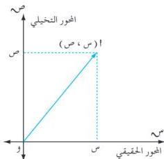

الوحدة الأولى

شكل (١-٢)

وعند تمثيل الأعداد المركبة كأزواج مرتبة بنقاط في المستوى الديكارتي يُعدُّ المحور السيني هو المحور الحقيقي والمحور الصادي هو المحور التخيلي، وعلى هذا الأساس يمثل العدد (س + ت ص) بالنقطة (س ، ص) كما في الشكل (١-٢).

يدل هذا على أن هناك تقابلاً بين مجموعة الأعداد المركبة ومجموعة نقاط المستوى. بناءً على ذلك يسمى المستوى بالمستوى المركب أو مستوى أرجاند نسبة للعالم الذي اقترح هذا التمثيل.

نعرف أن كل زوج (س ، ص) يمثل متجهاً قياسياً، وعليه فإن العدد المركب (س + ت ص) يمثل متجهاً قياسياً، هو $$\overline{أ} = (س ، ص)$$ .

# مثال (١-٤)

مثل الأعداد التالية في مستوى أرجاند، ثم مثل كلاً منها بمتجه قياسي :

أ) ٢ + ٥ ت ، ب) ٢ ت ، ج) ٤ ، د) ٤ - ٢ ت .

# الحل :

أ) العدد ٢ + ٥ ت يمثل بالنقطة (٢ ، ٥) ويمثل بالمتجه $$\overline{أ}$$ .

ب) العدد ٢ ت يمثل بالنقطة (٢ ، ٠) وبالمتجه $$\overline{ب}$$ .

ج) العدد ٤ يمثل بالنقطة (٤ ، ٠) وبالمتجه $$\overline{ج}$$ .

د) العدد ٤ - ٢ ت يمثل بالنقطة (٤ - ٢) ،

ويمثل بالمتجه $$\overline{د}$$ [كما في الشكل (١-٣)].

# تساوي الأعداد المركبة :

ليكن $$ع_١ = س_١ + ت ص_١ = (س_١ ، ص_١)$$

$$ع_٢ = س_٢ + ت ص_٢ = (س_٢ ، ص_٢)$$

فإذا كان $$ع_١ = ع$$ فإن (س ١ ، ص ١) = (س ٢ ، ص ٢) ، وهذا يؤدي إلى أن : $$س_١ = س ٢ ، ص ٨ = ص ٢$$

لذا نعرف تساوي عددين مركبين كالتالي :

١٠

http://www.e-learning-moe.edu.ye/