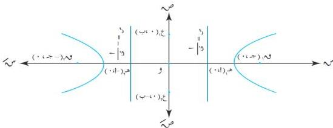

القطع الخروطية

$$(س + ج) + ص = (س - ج) + ص + ١٤ + ١٤ \sqrt{ (س - ج) + ص} \div ٢$$

$$\therefore ٤ \text{ جس} - ١٤ = ١٤ \sqrt{ (س - ج) + ص}$$

$$(ج - ١) = \sqrt{ (س - ج) + ص}$$

وبتربيع الطرفين مرة أخرى نحصل على :

$$ج - ٢ \text{ جس} + ٢ = (س - ج) + ص$$

$$\therefore \left( \frac{ج - ٢}{٢} - ص - ٢ \right) = ج - ٢$$

وبقسمة الطرفين على $$(ج - ٢)$$ :

$$١ = \frac{ص - ٢}{ج - ٢} - \frac{ص}{٢}$$

للتبسيط نضع : $$ج - ٢ = ب$$ ، حيث $$ج < ١$$ ، فتكون معادلة القطع الزائد هي :

$$(٧ - ٤) \dots \dots \dots$$

$$١ = \frac{ص - ٢}{ب} - \frac{ص}{٢}$$

تسمى المعادلة (٤ - ٧) بالصورة القياسية لمعادلة القطع الزائد .

[ انظر شكل (٤ - ١٩) ] .

شكل (٤ - ١٩)

١١٩

http://www.e-learning-moe.edu.ye/