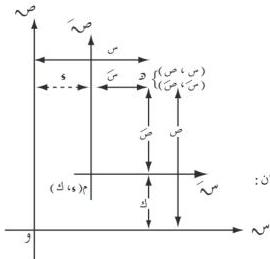

الوحدة الرابعة

## انسحاب المحاور الإحداثية

٤ - ٥

إن انسحاب المحاور يساعد على إيجاد معادلات القطوع المخروطية التي محاورها توازي محوري الإحداثيات لكن مراكزها لا تكون نقطة الأصل .

كما أنه إذا أحسن اختيار نقطة الأصل الجديدة للمحاور ، وكان لدينا معادلة منحنى معين في نظام إحداثي غير مناسب ، فإنه يمكننا تغيير هذا النظام للحصول على صورة قياسية لمعادلة هذا المنحنى ، فسحب المحاور يساعد على تبسيط معادلة المنحنى والحصول على صورتها القياسية .

ليكن س و ص مستوى الإحداثيات المتعامدة ، م نقطة في المستوى إحداثياها ( و ، ك ) .

فإذا رسمنا من م المحورين م س ، م ص موازين للمحورين و س ، و ص على الترتيب ، وأخذنا أي نقطة مثل و في المستوى ، وكان إحداثياها ( س ، ص ) بالنسبة للمحورين الأصليين ، وإحداثياها ( س ، ص ) بالنسبة للمحورين الجديدين فإننا نجد من الشكل (٤-٢٢) أن :

شكل (٤-٢٢)

... (٤-٩)

س = س + و ، ص = ص + ك
أو س = س - و ، ص = ص - ك

هاتان المعادلتان تسميان معادلتي الانسحاب .

لإيجاد معادلات القطوع التي مراكزها ليست نقطة الأصل ، نسحب المحاور الإحداثية لتحويل معادلات الدرجة الثانية ذات الصورة :

١ س + ج ص + ه س + ح ص + ط = .

إلى الصور القياسية التي مرت معنا سابقا .

كل قطع مخروطي له محور يوازي أحد محوري الإحداثيات تكون معادلته على صورة المعادلة ( ١ ) ، والعكس أيضا صحيح مع استثناءات بسيطة . فإذا كان :

( ١ ) ا ، ج لهما الإشارة نفسها ، فإن المعادلة تمثل قطعاً ناقصاً ( دائرة وذلك عندما ا = ج ، أو نقطة ، أو تكون مجموعة خالية ) .

( ٢ ) ا ، ج لهما إشارتان مختلفتان ، فإن المعادلة تمثل قطعاً زائداً أو مستقيمين متقاطعين .

( ٣ ) أحد العددين ا أو ج يساوي صفراً ، فإن المعادلة تمثل قطعاً مكافئاً ، ( أو مستقيمين متوازيين ، أو مستقيماً واحداً ، أو مجموعة خالية ) .

١٢٤

http://www.e-learning-moe.edu.ye/