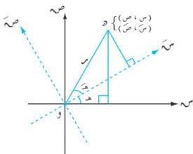

القطوع المحروطة

# دوران المحاور الإحداثية

٤ - ٦

إذا دار المحوران س و ص حول نقطة الأصل إلى وضع س و ص كما في الشكل (٤-٢٤)، فإن العلاقة بين الإحداثي (س، ص) في النظام الأول والإحداثي (س، ص) في النظام الثاني لنقطة

و في المستوى يمكن توضيحها على النحو التالي:

لتكن هـ قياس دوران زاوية المحورين في اتجاه ضد

حركة عقارب الساعة، هـ قياس الزاوية المحصورة

بين المحور و س والقطعة المستقيمة و و.

فإذا كان م يرمز لطول القطعة المستقيمة و و،

فإن:

س = م جتا (هـ + هـ)، ص = م جا (هـ + هـ)

باستخدام صيغتي الجيب وجيب التمام لمجموع

زاويتين نحصل على:

س = م جتاه جتاه - م جاه جاه

ص = م جتاه جاه + م جاه جتاه

ولكن س = م جتاه، ص = م جاه،

وبالتعويض في المعادلتين الأخيرتين نجد أن:

س = س جتاه - ص جاه

ص = س جاه + ص جتاه

... (٤-١٠)

هاتان المعادلتان تعطيان إحداثي و في النظام س و ص بدلالة إحداثيها في النظام س و ص.

وتسميان معادلتي الدوران.

شكل (٤-٢٤)

١٢٩

http://www.e-learning-moe.edu.ye/