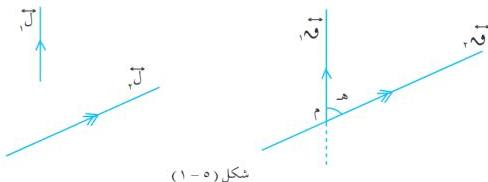

الوحدة الخامسة

الهندسة الفضائية

# المستقيم العمودي على مستوى

٥ - ١

الزاوية بين مستقيمين :

إن الزاوية بين أي مستقيمين لـ ، لـ في الفضاء هي الزاوية بين المستقيمين ق ، ق ، المرسومين من أي نقطة م في الفضاء والموازيين للمستقيمين لـ ، لـ . [ شكل (٥ - ١) ] .

ومن الشكل يمكن أن نلاحظ أن :

١ - قياس الزاوية بين المستقيمين لا يتأثر بموقع النقطة م فيمكن أن تكون النقطة م على أحد المستقيمين .
٢ - المستقيمين ( غير المنطقيين ) يصنعان زاويتين بينهما ، كل منهما تكمل الأخرى ؛ وتُعد الزاوية بين المستقيمين هي الزاوية غير المنفردة .

١٣٣

http://www.e-learning-moe.edu.ye/