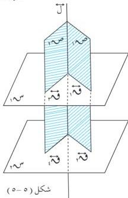
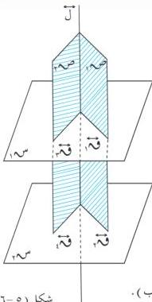

الهندسة الفضائية

شكل (٥-٥)

∴ قَم // قَم ، ∴ ل س م

∴ ل س قَم

∴ ل س قَم

بالمثل نجد أن :

ل س قَم

∴ قَم ، قَم متقاطعان في المستوى س م .

∴ ل س م ( وهو المطلوب ) .

# **مبرهنة (٥-٣)**

المستويان العموديان على مستقيم واحد متوازيان .

شكل (٥-٦)

المعطيات : ل س م ، ل س م [ شكل (٥-٦) ]

المطلوب : إثبات أن س م // س م .

البرهان : نرسم المستويين ص م ، ص م المتقاطعين في

ل بحيث ص م يقطع س م ، س م في

قَم ، قَم على التوالي ، ص م يقطع س م ، س م

في قَم ، قَم على التوالي .

∴ ل س م ، ل س م

∴ ل س قَم ، ل س قَم .

∴ قَم ، قَم ، ل يجمعهم مستوى واحد هو ص م ،

∴ قَم // قَم ... (١) .

وبالمثل نجد قَم // قَم ... (٢) .

من (١) ، (٢) ينتج أن : س م // س م ( وهو المطلوب ) .

# **نتيجة (١) :**

المستويات العمودية على مستقيم واحد متوازية .

١٣٧

http://www.e-learning-moe.edu.ye/