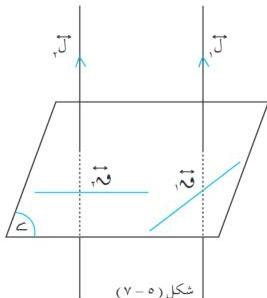

الوحدة الخامسة

# **مبرهنة (٥ - ٤)**

المستوى العمودي على أحد مستقيمين متوازيين عمودي على الآخر .

المعطيات : ل / ل ، ل / ل [ شكل (٥ - ٧) ]

المطلوب : إثبات أن ل / ل .

البرهان : نرسم في المستوى  $\leq$  مستقيمين غير

متوازيين ق ، ق .

ل / ل .

ل / ق ، ل / ق .

ل / ل (معطي)

ل / ق ، ل / ق .

ل / ل (وهو المطلوب) .

شكل (٥ - ٧)

# **نتائج :**

(٢) من نقطة ب لا يمكن رسم سوى مستوى واحد عمودي على مستقيم مفروض ل .

(٣) إذا كان ل مستقيماً عمودياً على  $\leq$  ، ب  $\leq$  ، فإن جميع المستقيمات المارة

بالنقطة ب وعمودية على ل تقع في  $\leq$  .

(٤) جميع المستقيمات المرسومة من نقطة واحدة وعمودية على مستقيم ل تقع في مستوى

واحد عمودي على المستقيم ل .

(٥) من نقطة ب لا يمكن رسم سوى مستقيم واحد عمودي على المستوى  $\leq$  (نقطة ب قد تنتمي

للمستوى  $\leq$  وقد تقع خارجه) .

# **مبرهنة (٥ - ٥)**

المستقيمان العموديان على مستوى واحد متوازيان .

المعطيات : ل / ل ، ل / ل [ شكل (٥ - ٨) ]

المطلوب : إثبات أن ل / ل .

البرهان : نفرض ل / ل .

١٣٨

http://www.e-learning-moe.edu.ye/