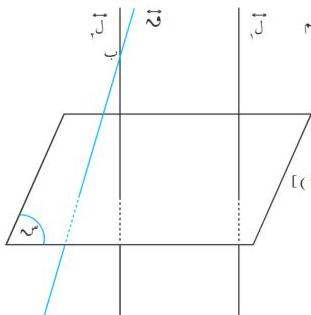
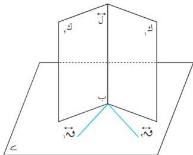

الهندسة الفضائية

شكل (٥-٨)

ولناخذ نقطة ب و ل و نرسم منها المستقيم

ق // ل

∴ ل س

∴ ق س [ مبرهنة (٥-٤) ]

∴ ل س

∴ ق منطبق على ل [ نتيجة (٥-٤) ]

∴ ق // ل

∴ ل // ل ( وهو المطلوب ) .

نتيجة (٦) :

المستقيمات العمودية على مستوى واحد متوازية

مثال (٥-٢)

إذا كان ق ، ق مستقيمين واقعين في ، ومتقاطعين في النقطة ب . والمستويان ك ، ك يمران بالنقطة ب ، بحيث ق ل ك ، ق ل ك [ شكل (٥-٩) ] .

أثبت أن الفاصل المشترك للمستويين ك ، ك عمودي على .

المعطيات : ق ، ق ، ق ، ق ، ق ، ق = {ب} .

ك ، ك = ل ، ب و ل .

ق ل ك ، ق ل ك .

المطلوب : إثبات أن : ل ل .

البرهان : ∴ ق ل ك

∴ ق ل ل

∴ ق ل ك .

∴ ق ل ل

∴ ق ، ق يجمعهم .

∴ ل ل .

وهو المطلوب .

شكل (٥-٩)

١٣٩

http://www.e-learning-moe.edu.ye/