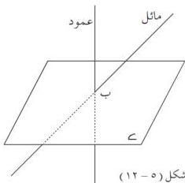
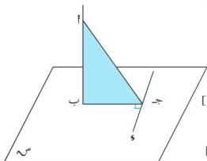

الوحدة الخامسة

## العمود والمائل

٥ - ٢

تعلم أنه من نقطة ب الواقعة في المستوى ٥ ، تستطيع أن ترسم مستقيماً وحيداً عمودياً على المستوى ٥ ، وكل مستقيم آخر يمر بالنقطة ب غير المستقيم العمودي يكون مائلاً على المستوى [ شكل (٥ - ١٢) ] .

### تعريف (٥ - ١)

المائل هو المستقيم القاطع لمستوى ، وليس عمودياً عليه

شكل (٥ - ١٢)

### (مبرهنة الأعمدة الثلاثة)

### مبرهنة (٥ - ٦)

إذا كان بَجَّ ، جَوَّ مستقيمين متعامدين واقعين في المستوى س ، وكان أَبَّ س م ؛ فإن وَجَّ أ جَّ أ .

المعطيات : بَجَّ أ جَوَّ ، بَجَّ ، جَوَّ واقعان في س ،

أَبَّ س م [ شكل (٥ - ١٣) ]

المطلوب : إثبات أن وَجَّ أ جَّ أ ،

البرهان : بَبَّ أ بَّ س م (معطى)

بَبَّ أ بَّ وَجَّ ... (١) ... [ حقيقته (٥ - ١) ]

بَجَّ وَجَّ بَجَّ ... (٢) ... (معطى)

بَجَّ وَجَّ أ المستوى (أ ب ج) [ مبرهنة (٥ - ١) ]

بَجَّ وَجَّ جَّ أ جَّ أ [ حقيقته (٥ - ١) ] (وهو المطلوب) .

شكل (٥ - ١٣)

### عكس المبرهنة (٥ - ٦) :

إذا كان بَجَّ ، جَوَّ مستقيمين متعامدين واقعين في المستوى س ، أ ب س م ، أ جَّ أ جَوَّ ، أ بَّ بَجَّ ؛ فإن أَبَّ س م .

### تدريب (٥ - ١)

برهن عكس مبرهنة (٥ - ٦) .

١٤٢

http://www.e-learning-moe.edu.ye/