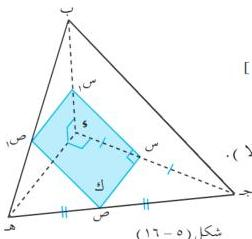
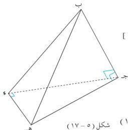

الهندسة الفضائية

البرهان : $$\therefore \text{هـ} (\text{جوه}) = \text{هـ} (\text{بوه}) = 90^\circ$$

$$\therefore \text{هـ} \text{جوه} \text{، هـ} \text{بوه} \text{ (معطي)}$$

$$\therefore \text{هـ} \text{المستوى (ب جو) [مبرهنة (٥-١)]}$$

$$\therefore \text{س، ص منتصفا وج، جده}$$

$$\therefore \text{س ص // وه}$$

$$\therefore \text{س ص} \text{المستوى (ب جو) (هـ.ط أولا).}$$

$$\therefore \text{ب ج // ك}$$

$$\therefore \text{ك يقطع المستويين (ب جو)، (ب جده)}$$

$$\text{في س س، ص ص}$$

$$\therefore \text{ب ج // س س، // ص ص} \dots \dots \dots (1)$$ (من مبرهنات التوازي)

$$\therefore \text{وه // س ص} \text{، س ص ك}$$

$$\therefore \text{ك يقطع المستوى (ب وه) في س ص، س ص // وه}$$

$$\therefore \text{س ص ص // س ص} \dots \dots \dots (2)$$

من (١)، (٢) ينتج أن الشكل س ص ص س متوازي أضلاع.

الآن نبرهن أن إحدى الزوايا قائمة.

$$\therefore \text{س ص} \text{المستوى (ب جو)}$$

$$\therefore \text{هـ} (\text{س ص ص}) = 90^\circ$$

$$\therefore \text{الشكل س ص ص س مستطيل}$$ (وهو المطلوب ثانيا).

# مثال (٥-٧)

ب جوه رباعي سطوح، فيه $$\text{ب ج} \text{المستوى (جوه)}$$، $$|\text{ب ه}|^2 = |\text{ب ج}|^2 + |\text{ج} |^2 + |\text{و} |^2$$،

أثبت أن : $$\text{وه} \text{المستوى (ب جو)}$$.

المعطيات : ب جوه رباعي سطوح.

$$\text{ب ج} \text{المستوى (جوه) [الشكل (٥-١٧)]}$$

$$|\text{ب ه}|^2 = |\text{ب ج}|^2 + |\text{ج} |^2 + |\text{و} |^2$$

المطلوب : إثبات أن $$\text{وه} \text{المستوى (ب جو)}$$

البرهان : $$\therefore \text{ب ج} \text{المستوى (جوه)}$$

$$\therefore \text{ب ج} \text{جوه} \text{ [عكس حقيقة (٥-١)]}$$

نطبق مبرهنة فيثاغورث على $$\Delta$$ ب جده

$$\therefore |\text{ب ه}|^2 = |\text{ب ج}|^2 + |\text{ج} |^2 \dots \dots \dots (1)$$

شكل (٥-١٧)

١٤٥

http://www.e-learning-moe.edu.ye/