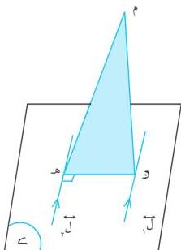

الوحدة الخامسة

∴ | ب ه | = | ب ج | + | ج و | + | و ه | ( معطى ) ... (٢)

من (١) ، (٢) ينتج أن | ج ه | = | ج و | + | و ه |

∴ Δ ج و ه قائم في و ( عكس مبرهنة فيثاغورث )

∴ ه و ل ج و ... (٣)

∴ ب ج ل المستوى ( ج و ه )

∴ ب ج ل ه و ... (٤)

من (٣) ، (٤) ينتج أن :

ه و ل المستوى ( ب ج و ) [ مبرهنة (٥ - ١) ] ( وهو المطلوب ) .

# مثال (٥ - ٨)

في الشكل (٥-١٨) ل ، ل مستقيمان متوازيان في ح ، م و ل ، و ه ل ، و ه ل ، أثبت أن ل المستوى ( م و ه ) .

المعطيات : ل // ل ، ل ، ل واقعان في ح .

م و ل ، و ه ل .

المطلوب : إثبات أن ل المستوى ( م و ه )

البرهان : ∴ و ه ل ، ل // ل

∴ و ه ل ، ... (١)

∴ م و ل ، ... (٢)

من (١) ، (٢) ينتج أن :

ل المستوى ( م و ه ) [ مبرهنة (٥-١) ]

( وهو المطلوب )

شكل (٥-١٨)

١٤٦

http://www.e-learning-moe.edu.ye/