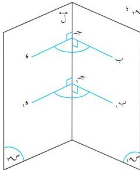

الهندسة الفضائية

## تمارين ومسائل (٥-٢)

[١] بَجَّ ، جَوَّ مستقيمان متعامدان في ج ، بَ ا لَ ، حيث ا و ا ؛ أثبت أن : جَوَّ ا لَ جَ .

[٢] ا بَ ا لَ ، و ، و نقطتان في ج ، ا و ا = ا و ا ؛ أثبت أن : ا ب و ا = ا ب و ا .

[٣] ا ب ج مثلث قائم في ب ، و ا ل المستوى ( ا ب ج ) . أثبت أن :

أولاً : ا و ج = ا و ا + ا ب + ا ب ج = ا . ثانياً : جَبَ ا و ب .

[٤] ا ب ج و مربع طول ضلعه ٦ سم ، أقمنا و م عموداً على مستواه من مركزه ( م ) ، ه منتصف

ا ب ، ا م و ا = ٤ سم ؛

أولاً : أثبت أن ا بَ ا و ه .

ثانياً : أثبت أن ا و ا = ا و ب .

ثالثاً : أوجد طول و ه ، ثم أوجد مساحة كل من المثلثات و م ه ، ا ب و ، ا ب م .

[٥] ب ج و مثلث قائم في ج ؛ أقمنا من ب العمود ا بَ على مستواه ؛ بحيث ا ب ا = ا و ج = ا ب ج .

أثبت أن : ا و ا = ا ب ج .

[٦] بَجَّ ، جَوَّ مستقيمان متعامدان في المستوى ج ، ا و ج ، ا ج ل ج و ،

ا بَ ا ل ب ج . أثبت أن ا بَ ا لَ .

## الزاوية الزوجية

٥-٣

عرفت أن هناك أربعة أوضاع نسبية للمستويين س ، س ؛ ومن هذه الأوضاع أن يكون المستويان متقاطعين في ل [شكل (٥-١٩) ] . والجزء من الفراغ المحدد بنصفي المستويين س ، س والمستقيم ل تسمى بالزاوية الزوجية (الثنائية) .

### تعريف (٥-٢)

الزاوية الزوجية هي اتحاد نصفي مستويين س ، س بجبهة مشتركة ل ؛ تسمى الجبهة المشتركة بحرف الزاوية الزوجية ، ويسمى كل من نصفي المستويين س ، س وجهي الزاوية الزوجية .

شكل (٥-١٩)

١٤٧

http://www.e-learning-moe.edu.ye/