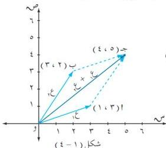

الأعداد المركبة

# مثال (١ - ٦)

أوجد ناتج ما يلي :

أ) (٢ + ٦ ت) + (٦ - ٨ ت) .
ب) (١/٢ - ٣/٤ ت) + (٢/٥ - ١/٥ ت) .
ج) (٨/١ + ١٢/٢ ت) - (٣٢/١ + ٢٧/٢ ت) .

الحل :

أ) (٢ + ٦ ت) + (٦ - ٨ ت)

= (٢ + ٦) + (٦ - ٨) ت

= ٨ + (٢ - ٢) ت = ٨ - ٢ ت

[ تعريف (١ - ٣) ]

ب) (١/٢ - ٣/٤ ت) + (٢/٥ - ١/٥ ت) = (٢/٥ - ١/٢) + (٣/٤ - ١/٥ ت) [ تعريف (١ - ٣) ]

= (٤ - ٥/١٠) + (٤ + ١٥/٢٠) ت = ١/١٠ + (١١/٢٠) ت = ١/١٠ - ١١/٢٠ ت .

ج) (٨/١ + ١٢/٢ ت) - (٣٢/١ + ٢٧/٢ ت) = (٨/١ - ٣٢/٢) + (١٢/٢ - ٢٧/٢) ت

[ تعريف (١ - ٣) ]

= (٢/٢ - ٢/٤) + (٢/٢ - ٣/٢) ت = (٢/٢ - ٢/٤) + (٣/٢ - ٣/٢) ت = ٢/٢ - ٣/٢ .

# مثال (١ - ٧)

لتكن ع₁ = ٣ + ت ، ع₂ = ٢ + ٣ ت ؛ أوجد ناتج ما يلي ومثله هندسياً :

أ) ع₁ + ع₂ . ب) ع₁ - ع₂ .

الحل :

أ) ع₁ + ع₂ = (س₁ + س₂) + ت (ص₁ + ص₂)

= (٣ + ٢) + (١ + ٣) ت

= ٥ + ٤ ت .

١٣

http://www.e-learning-moe.edu.ye/