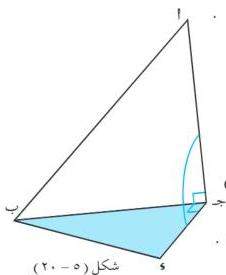
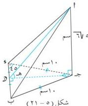

الوحدة الخامسة

يرمز للزاوية الزوجية بين س م ، س م بالرمز ( س م ، س م ) ، كما يرمز لها بالرمز ( ل ) ، وإذا اخترنا النقطة ج على المستقيم ( ل ) ورسمنا منها ( ج ج ، ج ل ) ، بحيث ( ج ج ، ج س ) ، ثم نرسم ( ج ج ، ج ل ) ، بحيث ( ج ج ، ج س ) سنحصل على زاوية مستوية هي ( ج ج ) ؛ تسمى هذه الزاوية بالزاوية الخطية للزاوية الزوجية ( س م ، س م ) ، ويمكن اختيار النقطة ج في أي موضع من ( ل ) ، فنجد أن : ( ج ج ، ج و ) = ( ج ج ، ج و ) .

# تعريف ( ٥ - ٣ )

الزاوية الخطية هي زاوية مستوية مرسومة في وجهي الزاوية الزوجية بحيث يكون ضلعاها عمودين على حرف الزاوية الزوجية .
قياس الزاوية الزوجية هو قياس زاويتها الخطية .

# مثال ( ٥ - ٩ )

ب ج و مثلث قائم في ج ، نقطة خارجة عن مستواه ، بحيث ( ج ج ، ج ل ) . أثبت أن ( ج ج ) هي الزاوية الخطية للزاوية الزوجية بين المستويين ( ب ج و ) ، ( ب ج ) .

المعطيات : ب ج و مثلث قائم في ج ، ( ج ج ، ج ل ) [ شكل ( ٥ - ٢٠ ) ] .

المطلوب : إثبات أن ( ج ج ) هي الزاوية الخطية للزاوية الزوجية بين المستويين ( ب ج و ) ، ( ب ج )

البرهان : المستوى ( ب ج و ) المستوى ( ب ج ) = ب ج

ب ج ، ج ل ، ج ل ، ج ل ، ج ل ، ج ل ، ج ل ( معطى )

ب ج ( ج ج ) هي الزاوية الخطية للزاوية الزوجية بين

المستويين ( ب ج و ) ، ( ب ج ) [ تعريف ( ٥ - ٤ ) ] .

شكل ( ٥ - ٢٠ )

# مثال ( ٥ - ١٠ )

ب ج و مثلث قائم في ج ، ( ب ج ) = ( ج ج ) = ١٠ سم ،

( ج ج ، ج ل ) المستوى ( ب ج و ) . احسب قياس الزاوية الزوجية بين

المستويين ( ب ج و ) ، ( ج ب و ) ، إذا علمت أن ( ج ج ) = ( ج ج ) سم .

المعطيات : ب ج و قائم في ج .

( ب ج ) = ( ج ج ) = ١٠ سم ،

( ج ج ، ج ل ) المستوى ( ب ج و )

( ج ج ) = ( ج ج ) سم [ شكل ( ٥ - ٢١ ) ]

شكل ( ٥ - ٢١ )

١٤٨

http://www.e-learning-moe.edu.ye/