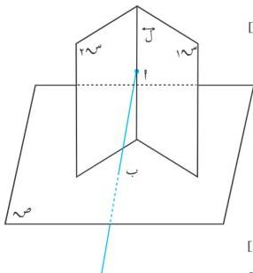

الهندسة الفضائية

[حقيقة (٥-١)]

∴ لَ أ بَ

∴ و (أ ب ج) = ٩٠°

∴ و (أ ب ج) = ٩٠°

∴ لَ ك ( وهو المطلوب ) .

نتيجة (٧) :

إذا كان ك ، م مستويين متعامدين ، فإن كل مستقيم عمودي على م من نقطة ب ك يقع في ك .

مبرهنة (٥-٩)

إذا تعامد كل من المستويين م ، م مع مستوى ثالث م ، فإن الفاصل المشترك للمستويين م ، م عمودي على المستوى م .

المعطيات : م ، م ، م ، م

م م م م م م م م م م م م م م م م م م م م م م م م م م م م م م م م م م م م م م م م م م م م م م م م م م م م م م م م م م م م م م م م م م م م م م م م م م م م م م م م م م م م م م م م م م م م م م م م م م م م م

المطلوب : إثبات أن لَ م م .

البرهان : نفرض أن : لَ م م

لناخذ نقطة ا ل

نرسم منها ا ب م م

∴ ا ل ، ا ل م م ،

∴ م ، م

∴ ا ب م م [نتيجة (٧)]

بالمثل نجد ا ب م م [نتيجة (٧)]

∴ ا ب هو الفاصل المشترك للمستويين م ، م

∴ ا ب منطبق على ل

∴ ا ب م م ، ∴ ل م م ( وهو المطلوب ) .

شكل (٥-٢٤)

١٥١

http://www.e-learning-moe.edu.ye/