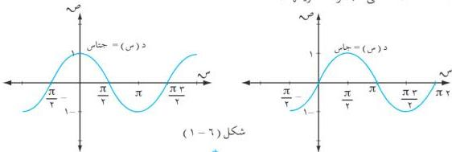

التفاصيل

## ثانياً : اتصال الدوال المثلثية :
تذكر أن :

١) الدالة د تكون متصلة عند س = ١ ⇔ نُهْجَا د (س) = د (١) .

٢) إذا كانت الدالة د معرّفة على فترة أو أكثر فالدالة د تكون متصلة إذا وفقط إذا كانت متصلة عند كل نقطة من نقاط مجموعة تعريفها .

فمثلاً : نُهْجَا = جتا س = جتا ١ ، نُهْجَا = جتا س = جتا ١ ، والتساؤل هنا : هل نهاية كل من الدالتين جتا س ، جتا س تساوي قيمتها لتكون متصلة عند النقطة ١ ، وجميع النقاط لمجموعة تعريفها ؟
وللإجابة عن هذا التساؤل نستخدم علاقة الفرق بين دالتي جيب التمام بالصورة :

جتا س - جتا ١ = ٢ - جتا ١ + س/٢ = جتا ١ - س/٢
وبأخذ النهاية للطرفين نجد أن :

نُهْجَا (جتا س - جتا ١) = ٢ - نُهْجَا = جتا س + ١ + س/٢ × نُهْجَا = جتا س - ١ + س/٢
عندئذٍ نلاحظ أن الطرف الأيسر يمثل جداء دالتين هما :

الأولى : محدودة بالصورة | ٢ جتا ١ + س/٢ | ≥ ٢ عندما س ← ١ .

الثانية : | جتا س - ١ + س/٢ | < ٠ عندما س ← ١ ، [ واستناداً إلى المبرهنة (٦ - ٢) ]
فإن الطرف الأيسر ← ٠ .

∴ نُهْجَا (جتا س - جتا ١) = ٠ ⇔ نُهْجَا = جتا س = جتا ١ ... (١) ...
س ← ١

وبالمثل يمكن إثبات أن : نُهْجَا = جتا س = جتا ١ ... (٢) ...

ومن (١) ، (٢) نستنتج أن نهاية كل من الدالتين جتا س ، جتا س تساوي قيمتها ، وهذا ما يوضح أن كلًا منهما دالة متصلة على مجموعة تعريفها .

شكل (٦ - ١)

١٥٧

http://www.e-learning-moe.edu.ye/