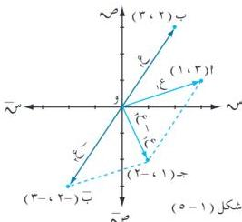

الوحدة الأولى

ب) ع₁ + (ع₂) = (٣ + ت) - (٢ + ٣ ت)
= (٣ - ٢) + (١ - ٣) ت
= ١ - ٢ ت .

# خواص جمع الأعداد المركبة :

١) عملية الجمع تبديلية على م ؛ أي أن : ع₁ + ع₂ = ع₂ + ع₁ ، v ع₁ ، ع₂ ∈ م .
لإثبات ذلك :

ع₁ + ع₂ = (س₁ + ت ص₁) + (س₂ + ت ص₂) = (س₁ + س₂) + ت (ص₁ + ص₂) [تعريف (١-٣) ]
= (س₂ + س₁) + ت (ص₂ + ص₁) [الجمع تبديلي على ح ]
= (س₂ + ت ص₂) + (س₁ + ت ص₁) = ع₂ + ع₁ .

٢) عملية الجمع تجميعية على م ؛ أي أن :

(ع₁ + ع₂) + ع₂ = ع₁ + (ع₂ + ع₂) ، v ع₁ ، ع₂ ، ع₂ ∈ م .
وعلى الطالب إثبات ذلك بطريقة مشابهة لإثبات خاصية التبديل .

٣) الصفر هو العنصر المحايد الجمعي للمجموعة م أي أن :

ع + ٠ = ٠ + ع = ع ، v ع ∈ م .

ولإثبات ذلك نفرض أن العنصر المحايد الجمعي هو (t + ت ب) ∈ م .

وليكن ع ∈ م حيث ع = (س + ت ص) .

∴ (س + ت ص) + (t + ت ب) = (س + ت ص) [تعريف العنصر المحايد ]

(س + t) + ت (ص + ب) = س + ت ص [تعريف الجمع ] .

∴ س + t = س ⇐ t = س - س = ٠ [تساوي عددين مركبين ] .

وبالمثل ص + ب = ص ⇐ ب = ص - ص = ٠ .

∴ t + ت ب = (t ، ب) = (٠ ، ٠) العنصر المحايد لعملية الجمع .

١٤

http://www.e-learning-moe.edu.ye/