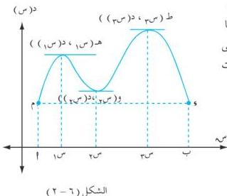

التفاصيل

# مبرهنتا رول والقيمة المتوسطة

٦ - ٧

أولاً : مبرهنة رول :

ليس دائماً من السهل إيجاد قيم س التي تجعل المشتقة الأولى د(س) = ٠ ، لذا جاءت مبرهنة رول لتكون في مقدمة المبرهنات الهامة لإيضاح الشروط التي تتحدد بها مثل هذه القيم.

مبرهنة (٦ - ٤)

إذا كانت الدالة د متصلة على الفترة [t ، ب] ، وقابلة للاشتقاق على الفترة [t ، ب] ، وكان د(t) = د(ب) ؛ فإنه يوجد عدد واحد على الأقل ج = ٢ ، ب بحيث يكون د(ج) = ٠ .

المعنى الهندسي لمبرهنة رول :

من الشكل (٦-٢) لبيان منحنى دالة د (افتراضية) المتصلة على الفترة [t ، ب] والقابلة للاشتقاق على الفترة [t ، ب] تلاحظ ما يلي :

د(t) = د(ب) وبين العددين س = t ، س = ب
يوجد ثلاثة أعداد هي : س₁ ، س₂ ، س₃ يناظرها ثلاث نقاط على الترتيب هـ ، و ، ط على منحنى الدالة ، المماس عند كل منها موازياً لمحور السينات من جهة ، والقاطع م و من جهة أخرى .

وهذا يعني بين النقطتين م ، و اللتين يتساوى إحداثيهما الصادي ، توجد نقطة واحدة على الأقل على المنحنى يكون عندها المماس موازياً للقاطع م و ، لذلك فإن المماس للمنحنى عند النقطة هـ (س₁ ، د (س₁) ) يساوي ميل القاطع م و

١٨٣

http://www.e-learning-moe.edu.ye/