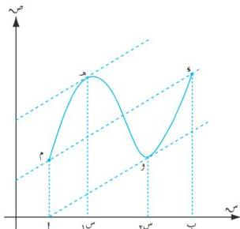

الوحدة السادسة

الشكل (٦ - ٤)

المماس عند كل منهما موازياً للقاطع $\bar{x}$ .
وهذا يعني أن بين النقطتين $x$ ، $y$ يوجد نقطة
واحدة على الأقل ، على المنحنى يكون المماس
عندها موازياً للقاطع $\bar{x}$ .

* بما أن ميل المماس عند نقطة يساوي مشتقة الدالة
عند هذه النقطة ، فإن مشتقة الدالة $x$ عند النقطة
هـ $(m_1, x(m_1))$ يساوي ميل القاطع $\bar{x}$ .

أي أن: $x(m_1) = \text{ميل } \bar{x} = \frac{x(m_1) - x(m_1)}{m - 1}$ ،

وبالمثل نجد عند النقطة و $(m_2, x(m_2))$ أن:

$x(m_2) = \frac{x(m_1) - x(m_1)}{m - 1}$ .

# **مثال (٦ - ٣٢)**

بيّن فيما إذا كانت الدالة $x(m) = m^{\frac{1}{2}}$ ؛ تحقق شروط مبرهنة القيمة المتوسطة على الفترة $[0, 8]$ ، وإذا تحققت ، أوجد قيم $w$ التي تعينها المبرهنة .

# **الحل :**

∴ الدالة $x$ متصلة $\forall m \in \mathbb{C}$ ، أي أنها متصلة على الفترة $[0, 8]$ ،

$x(m) = \frac{1}{3} m^{\frac{2}{3}}$ قابلة للاشتقاق $\forall m \in \mathbb{C}^*$ ،

∴ $0 \neq [0, 8]$ ، فإن الدالة $x$ قابلة للاشتقاق على الفترة $[0, 8]$ .

وبذلك فإن الدالة $x$ تحقق شروط مبرهنة القيمة المتوسطة على الفترة $[0, 8]$ عندئذ يوجد عدد واحد على

الأقل $w \in [0, 8]$ بحيث يكون :

$x(w) = \frac{x(0) - x(0)}{0 - 8}$ ، أي أن : $\frac{1}{3} w = \frac{2}{3} = \frac{2}{8} = \frac{1}{4} \Leftarrow w = \frac{2}{3} = \frac{3}{4}$ .

$\Leftarrow w = \frac{2}{3} = \frac{4}{3} \Leftarrow w = \frac{64}{27} = \frac{3}{4} = \frac{2}{27} \Leftarrow w = \pm \frac{8}{3\sqrt{3}}$ .

$\therefore w = \frac{8}{3\sqrt{3}} \in [0, 8]$ ، $w = \frac{8}{3\sqrt{3}}$ (مرفوضة لأن $\frac{8}{3\sqrt{3}} \neq [0, 8]$ .

١٨٦

http://www.e-learning-moe.edu.ye/