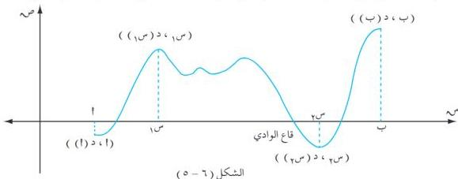

الوحدة السادسة

# مثال (٦ - ٣٥)

بين أن الدالة $x(m) = m + \text{جاس تزايدية على الفترة } [\frac{\pi}{2}, 0]$ .

# الحل :

د : دالة متصلة على $[\frac{\pi}{2}, 0]$ وقابلة للاشتقاق على $[\frac{\pi}{2}, 0]$ ،

$x(m) = 1 + \text{جاس}$ ؛ ويوضع $x(m) = 0 \iff \text{جاس} = 1 - 1$

$\therefore m = \pi \Rightarrow [\frac{\pi}{2}, 0]$

$\therefore$ ليس للدالة نقطة حرجة في الفترة $[\frac{\pi}{2}, 0]$ ، لذا نبحث عن إشارة $x(m)$ فنجد أن :

$\text{جاس} < 0, \forall m \subseteq [\frac{\pi}{2}, 0] \iff 1 + \text{جاس} < 0$ أي أن :

$x(m) < 0, \forall m \subseteq [\frac{\pi}{2}, 0]$ .

$\therefore$ الدالة $x$ تزايدية على الفترة $[\frac{\pi}{2}, 0]$ .

# ثانياً : القيم القصوى :

إذا تذكرت سلاسل الجبال في منطقتك أو مناطق أخرى قمت بزيارتها ، فإنك لا شك قد لاحظت أنها تبدو على شكل منحنى ، لها قمم شاهقة الارتفاع ، تنحدر بأوديتها نحو أدنى نقطة في أسفلها [انظر الشكل (٦-٥)] نموذج لدالة افتراضية . لتكن $x(m)$ تمثل تلك السلاسل على الفترة $[t, n]$ عندئذ يلاحظ من الشكل ما يلي :

الشكل (٦-٥)

1. يوجد للدالة $x$ قيمة عظمى محلية عند $m$ هي : $x(m)$ وذلك لأنها أكبر من القيم التي حولها .
2. للدالة $x$ قيمة عظمى محلية عند $n$ وهي : $x(n)$ وذلك لأنها أكبر من القيم التي حولها ، مع ملاحظة أن $x(n)$ أكبر قيم الدالة على الفترة $[t, n]$ لذلك تسمى بالقيمة العظمى المطلقة .
3. للدالة $x$ قيمة صغرى محلية عند $t$ وهي : $x(t)$ وذلك لأنها أصغر من القيم التي حولها .

١٩٠

http://www.e-learning-moe.edu.ye/