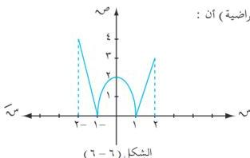

التفاصيل

٤) للدالة د قيمة صغرى محلية عند س r وهي : د(س r) وذلك لأنها أصغر من القيم التي حولها مع ملاحظة أن د(س r) هي أصغر قيم الدالة على الفترة [r, t] لذلك تسمى بالقيمة الصغرى المطلقة .

فمثلاً : يلاحظ من الشكل (٦-٦) لبيان الدالة د (الافتراضية) أن :

- النقطة (٢-٤) عظمى مطلقة
- النقطة (١-٠) صغرى مطلقة
- النقطة (٢,٠) عظمى محلية
- النقطة (١,٠) صغرى مطلقة
- النقطة (٢,٣) عظمى محلية

وعلى ذلك يمكن إيجاد القيم القصوى (عظمى أو صغرى) المحلية والمطلقة باستخدام اختبار المشتقة الأولى تبعاً لشروط المبرهنات التالية :

# مبرهنة (٦ - ٧)

إذا كانت د دالة متصلة عند القيمة الحرجة س = ب ؛ فإن :

١) د (ب) قيمة عظمى محلية للدالة د إذا كانت د (س) ≥ ٠
يسار العدد ب ، د (س) ≥ ٠ بين العدد ب
٢) د (ب) قيمة صغرى محلية للدالة د إذا كانت د (س) ≥ ٠
يسار العدد ب ، د (س) ≥ ٠ بين العدد ب

# مبرهنة (٦ - ٨)

إذا كان للدالة د قيمة قصوى محلية عند س = ب فإن :
د (ب) = ٠ ، أو د (ب) غير موجودة .

# عكس مبرهنة (٦ - ٨) :

إذا كانت د (ب) = ٠ ، أو غير موجودة ، فإنه ليس بالضرورة أن تكون د (ب) قيمة قصوى محلية للدالة د .

١٩١

http://www.e-learning-moe.edu.ye/