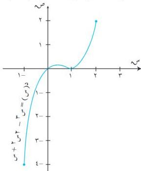

التفاصيل

٢) أوجد النقاط الحرجة للدالة في الفترة [ ١ ، ب ] .
٣) أوجد قيم الدالة عند جميع النقاط الحرجة التي حصلت عليها بالإضافة إلى د (١) ، د (ج) .
٤) حدد أكبر قيمة للدالة من بين القيم التي حصلت عليها لتكون هي القيمة العظمى المطلقة للدالة وأصغر قيمة لتكون هي القيمة الصغرى المطلقة للدالة .

# مثال (٦-٣٦)

إذا كانت د (س) = س³ - س² + س . أوجد القيم القصوى للدالة على الفترة [ ١-٢ ، ٢ ] موضحاً نوعها .

الشكل (٦-١٠)

١) الدالة د متصلة $\forall$ س $\subseteq$ ح ؛ لذا فهي متصلة على [ ١-٢ ، ٢ ] .
٢) نبحث عن النقاط الحرجة للدالة د ، حيث د (س) = س³ - س² - س + ١ ، وذلك بوضع د (س) = ٠ ، $\therefore$ س³ - س² - س + ١ = ٠ .
$\Leftarrow$ (س³ - س) (س - ١) = ٠ .
إما س = $\frac{1}{3}$ أو س = ١ ، د ( $\frac{1}{3}$ ) = $\frac{4}{27}$ ، د (١) = ٠ ،

نبحث الآن عن النقاط الحرجة عند اطراف الفترة [ ١-٢ ، ٢ ] فنجد أن :

د (١-٢) = ٤ ، د (٢) = ٢ .

إذن للدالة د نقاط حرجة عند قيم س التي تساوي ١- ، ١/٣ ، ١ ، ٢ ، والجدول (٦-٤) التالي يوضح القيم القصوى

|  س | ٢ | ١ | ١/٣ | ١-  |
| --- | --- | --- | --- | --- |
|  د (س) | + | ٠ | - | ٠  |
|  د (س) | ٢ | ٠ | ٤/٢٧ | ٤-  |

جدول (٦-٤)

١٩٣

http://www.e-learning-moe.edu.ye/